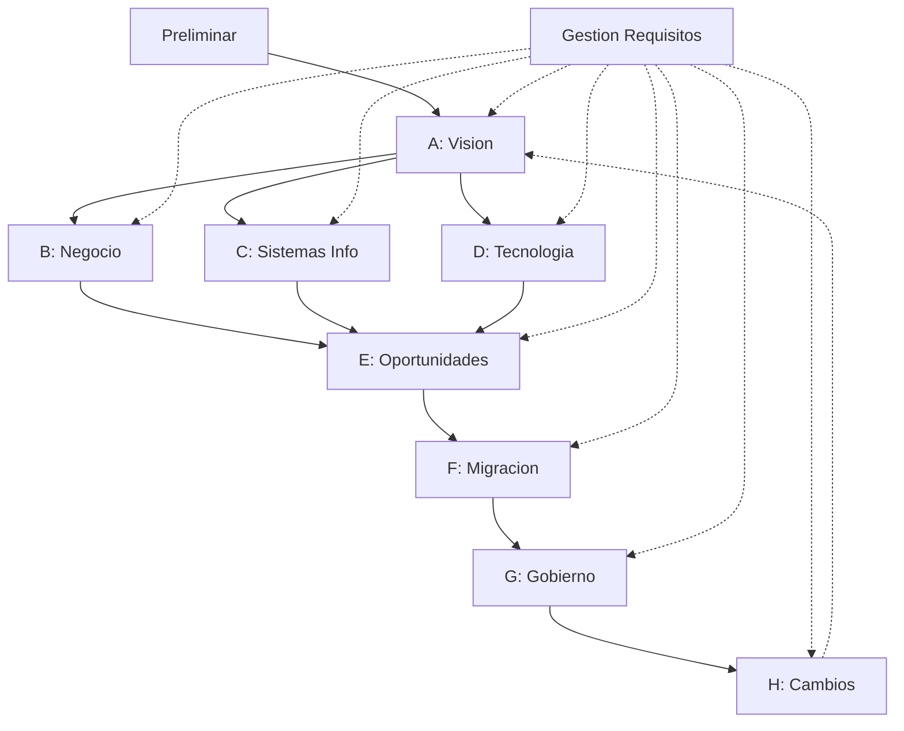

# Los Cuatro Pilares de TOGAF

**Tiempo estimado**: 30 minutos
**Nivel**: Intermedio
**Prerrequisitos**: Historia de TOGAF (1.1.1)

---

## Por que importa este subtema?

TOGAF no es un documento monolitico: esta organizado en cuatro componentes principales que trabajan juntos. Entender estos pilares te permite navegar el estandar eficientemente y saber donde buscar cuando necesitas informacion especifica.

Muchos practicantes cometen el error de enfocarse solo en el ADM e ignorar los otros tres pilares. Esto resulta en arquitecturas bien documentadas pero que no se reutilizan (falta Enterprise Continuum), que usan formatos inconsistentes (falta Content Framework), o que se implementan sin las tecnicas apropiadas (falta ADM Guidelines).

---

## Vision General de los Cuatro Pilares

```
+------------------------------------------------------------------+
|                    TOGAF STANDARD                                 |
+------------------------------------------------------------------+
|                                                                   |
|  +-------------------+  +-------------------+                     |
|  | PILAR 1: ADM      |  | PILAR 2: GUIAS   |                     |
|  | El Proceso        |  | Y TECNICAS       |                     |
|  |                   |  | El Como          |                     |
|  | "Que fases        |  | "Como aplicar    |                     |
|  |  ejecutar"        |  |  cada fase"      |                     |
|  +-------------------+  +-------------------+                     |
|                                                                   |
|  +-------------------+  +-------------------+                     |
|  | PILAR 3: CONTENT  |  | PILAR 4:         |                     |
|  | FRAMEWORK         |  | ENTERPRISE       |                     |
|  | El Que            |  | CONTINUUM        |                     |
|  |                   |  | La Biblioteca    |                     |
|  | "Que producir"    |  | "Donde guardar   |                     |
|  |                   |  |  y reutilizar"   |                     |
|  +-------------------+  +-------------------+                     |
|                                                                   |
+------------------------------------------------------------------+
```

---

## Pilar 1: El ADM (Architecture Development Method)

### Que es

El ADM es el proceso paso a paso para desarrollar arquitectura empresarial. Es el "motor" de TOGAF que guia al arquitecto desde la vision inicial hasta la gestion continua.

### Estructura



### Caracteristicas clave

| Caracteristica | Descripcion |
|----------------|-------------|
| Iterativo | Se puede volver a fases anteriores |
| Ciclico | Al terminar, puede iniciar nuevo ciclo |
| Adaptable | Fases pueden omitirse o combinarse |
| Centrado en requisitos | Requirements Management conecta todo |

### Cuando lo usas

- Al iniciar cualquier proyecto de arquitectura
- Para estructurar el trabajo del equipo de arquitectura
- Para establecer checkpoints y entregables

---

## Pilar 2: Guias y Tecnicas del ADM

### Que es

Complementa al ADM con tecnicas especificas para situaciones comunes. Mientras el ADM dice "que hacer", las guias dicen "como hacerlo" en contextos particulares.

### Guias principales

| Guia | Proposito | Cuando usarla |
|------|-----------|---------------|
| Iteracion del ADM | Como ejecutar el ADM en ciclos | Proyectos grandes que requieren refinamiento |
| Niveles de arquitectura | Aplicar ADM a diferentes alcances | Strategic vs Segment vs Capability |
| Seguridad | Integrar seguridad en cada fase | Proyectos con requerimientos de seguridad |
| SOA | Arquitecturas orientadas a servicios | Modernizacion con APIs/microservicios |
| Stakeholder Management | Gestionar interesados | Proyectos con multiples grupos de interes |

### Tecnicas principales

| Tecnica | Descripcion |
|---------|-------------|
| Principles Catalog | Como documentar principios de arquitectura |
| Business Scenarios | Derivar requisitos desde escenarios de negocio |
| Gap Analysis | Identificar diferencias baseline vs target |
| Migration Planning | Planificar transiciones |
| Interoperability | Asegurar que sistemas trabajen juntos |
| Readiness Assessment | Evaluar preparacion para cambio |

### Ejemplo: Tecnica de Business Scenarios

```
ESTRUCTURA DE UN BUSINESS SCENARIO
==================================

1. Problema/Oportunidad
   "Los clientes abandonan el carrito de compras
    porque el proceso de checkout es muy largo"

2. Ambiente de Negocio
   - E-commerce B2C
   - 500K visitantes/mes
   - 2% conversion actual

3. Objetivos
   - Reducir pasos de checkout de 7 a 3
   - Aumentar conversion a 4%

4. Actores
   - Cliente
   - Sistema de pagos
   - Sistema de inventario
   - Sistema de envios

5. Flujo del Proceso (deseado)
   - Cliente selecciona "comprar"
   - Sistema muestra resumen + opciones pago
   - Cliente confirma
   - Sistema procesa y confirma

6. Requisitos derivados
   - REQ-001: Integracion one-click con pasarelas
   - REQ-002: Calculo de envio en tiempo real
   - REQ-003: Persistencia de carrito cross-device
```

---

## Pilar 3: Architecture Content Framework

### Que es

Define los entregables, artefactos y building blocks que el ADM produce. Es el "que" de la arquitectura: que documentos crear, que diagramas usar, que elementos catalogar.

### Estructura del Content Framework

```
CONTENT FRAMEWORK
|
+-- Deliverables (Entregables)
|   |-- Documentos formales aprobados
|   |-- Ejemplo: Architecture Definition Document
|   |-- Ejemplo: Architecture Requirements Specification
|
+-- Artifacts (Artefactos)
|   |-- Componentes de los entregables
|   |-- Catalogos: Listas de elementos
|   |-- Matrices: Relaciones entre elementos
|   |-- Diagramas: Representaciones visuales
|
+-- Building Blocks
    |-- ABB: Architecture Building Blocks (conceptual)
    |-- SBB: Solution Building Blocks (implementacion)
```

### Tipos de artefactos

| Tipo | Descripcion | Ejemplos |
|------|-------------|----------|
| **Catalogo** | Lista de elementos del mismo tipo | Catalogo de aplicaciones, Catalogo de actores |
| **Matriz** | Relaciones entre elementos | Matriz Actor/Rol, Matriz App/Datos |
| **Diagrama** | Representacion visual | Diagrama de procesos, Diagrama de red |

### Content Metamodel

El metamodelo define las entidades y relaciones validas en una arquitectura TOGAF:

```
ENTIDADES POR DOMINIO
=====================

Negocio:
  - Organization Unit
  - Actor
  - Role
  - Business Service
  - Process
  - Function
  - Business Capability

Datos:
  - Data Entity
  - Logical Data Component
  - Physical Data Component

Aplicaciones:
  - Application Component
  - Application Service
  - Interface

Tecnologia:
  - Technology Component
  - Technology Service
  - Platform
```

---

## Pilar 4: Enterprise Continuum

### Que es

Es un modelo para clasificar y organizar activos de arquitectura segun su nivel de genericidad. Funciona como el sistema de organizacion de una biblioteca de arquitectura.

### El espectro del Continuum

```
<-- MAS GENERICO                          MAS ESPECIFICO -->
<-- MAS REUTILIZABLE                   MENOS REUTILIZABLE -->

+-------------+  +-------------+  +-------------+  +-------------+
| Foundation  |  | Common      |  | Industry    |  | Organization|
| Architectures  | Systems     |  | Architectures  | Architectures|
+-------------+  +-------------+  +-------------+  +-------------+
      |               |               |               |
      v               v               v               v
  Principios      Patrones de    Modelos de      Mi empresa
  universales     integracion    referencia      especifica
                  comunes        del sector
      |               |               |               |
      v               v               v               v
  "Toda app       "SOA pattern"  "Modelo BIAN    "Arquitectura
  necesita                       para banca"     Banco XYZ"
  autenticacion"
```

### Dos perspectivas del Continuum

| Architecture Continuum | Solutions Continuum |
|------------------------|---------------------|
| Guias y principios | Implementaciones concretas |
| "Como deberia ser" | "Como se construyo" |
| ABBs (Building Blocks conceptuales) | SBBs (Building Blocks de solucion) |

### Ejemplo practico

```
Necesito: Sistema de autenticacion

1. Foundation Architecture:
   - Principio: "Zero Trust - nunca confiar, siempre verificar"

2. Common Systems Architecture:
   - Patron: OAuth 2.0 + OpenID Connect

3. Industry Architecture:
   - Referencia: NIST SP 800-63 (identidad digital)

4. Organization Architecture:
   - Mi implementacion: Okta + Azure AD B2C + MFA obligatorio

REUTILIZACION:
- Niveles 1-3 vienen de la biblioteca
- Solo nivel 4 es trabajo nuevo
- Proximo proyecto reutiliza niveles 1-4
```

### El Architecture Repository

El Enterprise Continuum se materializa en un repositorio con estas secciones:

```
ARCHITECTURE REPOSITORY
|
+-- Architecture Metamodel
|   Definicion de entidades y relaciones validas
|
+-- Architecture Capability
|   Recursos, roles, governance
|
+-- Architecture Landscape
|   Baseline, Target, Transitions actuales
|
+-- Standards Information Base
|   Estandares adoptados (tecnicos, regulatorios)
|
+-- Reference Library
|   Modelos de referencia, patrones, templates
|
+-- Governance Log
|   Decisiones, dispensas, excepciones
```

---

## Como interactuan los cuatro pilares

```
+------------------+
| 1. ADM           |  "Estoy en Fase C, que debo hacer?"
+--------+---------+
         |
         v
+------------------+
| 2. GUIAS/TECNICAS|  "Usa la tecnica de Gap Analysis"
+--------+---------+
         |
         v
+------------------+
| 3. CONTENT FW    |  "Produce estos artefactos: Matriz App-Datos,
+--------+---------+   Catalogo de Interfaces, Diagrama de Integracion"
         |
         v
+------------------+
| 4. CONTINUUM     |  "Antes de crear desde cero, revisa la biblioteca:
+------------------+   hay patrones de integracion que puedes reutilizar"
```

---

## Resumen

| Pilar | Pregunta que responde | Donde encontrarlo |
|-------|----------------------|-------------------|
| ADM | Que proceso seguir? | Parte II del estandar |
| Guias y Tecnicas | Como aplicar el proceso? | Parte III del estandar |
| Content Framework | Que producir? | Parte IV del estandar |
| Enterprise Continuum | Donde guardar y reutilizar? | Parte V del estandar |

**Siguiente subtema**: Terminologia Clave TOGAF (1.1.3)
