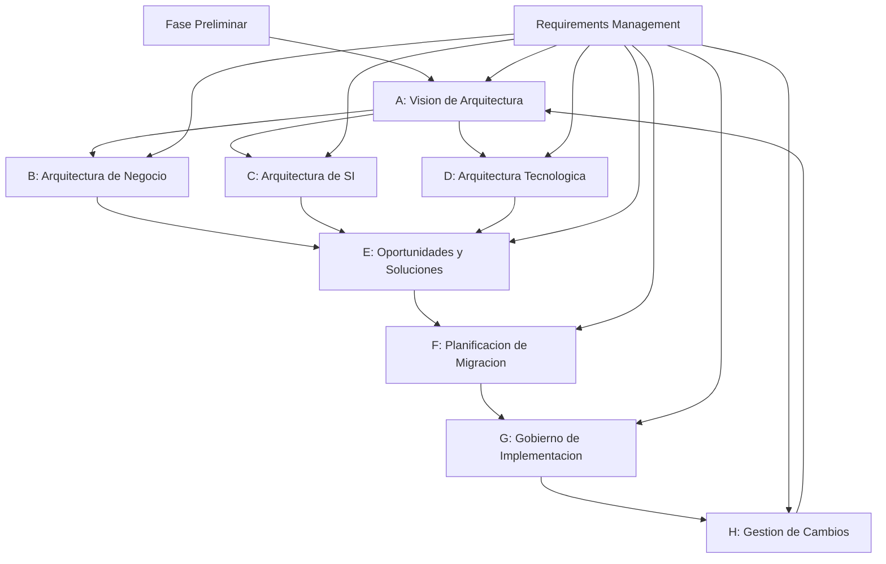
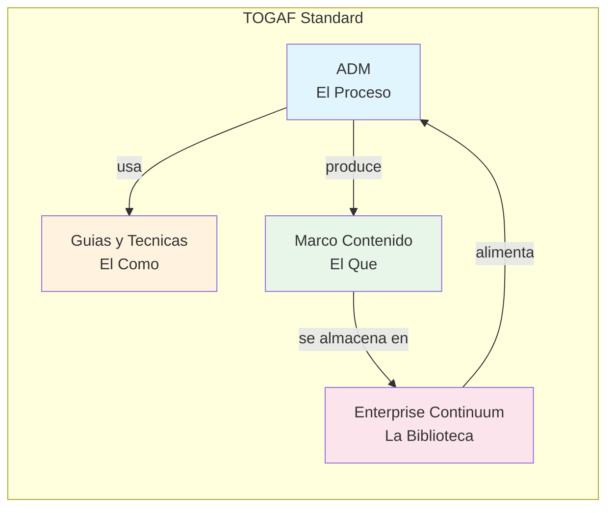

# Estructura del Estandar TOGAF

**Tiempo estimado**: 90 minutos
**Nivel**: Intermedio
**Prerrequisitos**: Conocimiento basico de organizaciones de TI, familiaridad con conceptos de arquitectura de software

## Por que importa este concepto?

El estandar TOGAF (The Open Group Architecture Framework) es el marco de arquitectura empresarial mas adoptado en el mundo, utilizado por mas del 80% de las empresas Fortune 500. Comprender su estructura no es simplemente un ejercicio academico: es la puerta de entrada para participar en proyectos de transformacion digital a escala empresarial.

Cuando una organizacion decide modernizar sus sistemas, migrar a la nube, o fusionarse con otra empresa, necesita un lenguaje comun para describir su estado actual y su estado deseado. TOGAF proporciona ese lenguaje, junto con un proceso metodico para navegar la transformacion. Sin este marco, los proyectos de arquitectura se convierten en esfuerzos fragmentados donde cada equipo usa terminologia diferente y sigue procesos incompatibles.

La estructura de TOGAF no es arbitraria: refleja decadas de experiencia destilada de cientos de organizaciones. Cada componente existe porque resuelve un problema recurrente en la practica de arquitectura empresarial.

## Conexion con conocimientos previos

Si has trabajado en desarrollo de software, ya conoces la diferencia entre arquitectura y diseno: la arquitectura define decisiones fundamentales que son costosas de cambiar, mientras que el diseno detalla la implementacion. TOGAF escala este concepto al nivel de toda la empresa, donde las decisiones afectan no solo codigo sino procesos de negocio, estructuras de datos, y plataformas tecnologicas completas.

---

## Comprension intuitiva

Imagina que TOGAF es como el manual de operaciones de una aerolinea. No te dice como pilotar cada avion especifico, pero establece los procedimientos estandar, los roles de la tripulacion, los protocolos de seguridad, y los formatos de comunicacion que permiten que cientos de vuelos operen de manera coordinada diariamente.

La aerolinea tiene:
- **Procedimientos operativos estandar** (como el ADM de TOGAF)
- **Roles definidos** (piloto, copiloto, controlador = arquitectos de diferentes dominios)
- **Documentacion estandarizada** (planes de vuelo = entregables de arquitectura)
- **Una biblioteca de patrones** (rutas aprobadas = el Enterprise Continuum)

### Ejemplo motivador

Una empresa de retail con 500 tiendas fisicas decide lanzar un canal de comercio electronico. Sin un marco de arquitectura:
- El equipo de e-commerce construye su propia base de datos de clientes
- El equipo de tiendas mantiene otra base de datos separada
- Marketing tiene una tercera fuente de datos de clientes
- Inventario no se sincroniza entre canales
- El cliente recibe experiencias inconsistentes

Con TOGAF:
- Se define una arquitectura objetivo donde existe una "fuente unica de verdad" para clientes
- Se mapean las dependencias entre sistemas
- Se crea un roadmap de migracion por fases
- Cada equipo trabaja hacia el mismo estado objetivo usando el mismo vocabulario

---

## Definicion formal

### El Estandar TOGAF: Definicion Oficial

TOGAF es un **marco de arquitectura** que proporciona:

1. Un **metodo** (ADM) para desarrollar arquitectura empresarial
2. **Guias y tecnicas** de soporte para aplicar el metodo
3. Un **marco de contenido** que define los entregables arquitectonicos
4. Un **modelo de referencia** para clasificar y reutilizar activos de arquitectura

**Definicion de Arquitectura Empresarial segun TOGAF**:

> "La arquitectura empresarial es un concepto con dos significados relacionados:
> 1. Una descripcion formal de un sistema, o un plan detallado del sistema a nivel de componentes para guiar su implementacion
> 2. La estructura de componentes, sus interrelaciones, y los principios y guias que gobiernan su diseno y evolucion a lo largo del tiempo"

### Los Cuatro Dominios de Arquitectura

TOGAF organiza la arquitectura empresarial en cuatro dominios interrelacionados:

```
+--------------------------------------------------+
|            ARQUITECTURA EMPRESARIAL              |
+--------------------------------------------------+
|                                                  |
|   +------------------------------------------+   |
|   |      ARQUITECTURA DE NEGOCIO             |   |
|   |  Estrategia, gobernanza, organizacion,   |   |
|   |  procesos clave de negocio               |   |
|   +------------------------------------------+   |
|                       |                          |
|                       v                          |
|   +------------------------------------------+   |
|   |  ARQUITECTURA DE SISTEMAS DE INFORMACION |   |
|   |  +----------------+  +----------------+  |   |
|   |  | Arq. de Datos  |  | Arq. de Apps   |  |   |
|   |  +----------------+  +----------------+  |   |
|   +------------------------------------------+   |
|                       |                          |
|                       v                          |
|   +------------------------------------------+   |
|   |      ARQUITECTURA TECNOLOGICA            |   |
|   |  Capacidades de software y hardware      |   |
|   |  requeridas para soportar SI y negocio   |   |
|   +------------------------------------------+   |
|                                                  |
+--------------------------------------------------+
```

### Propiedades fundamentales

1. **Modularidad**: TOGAF puede adoptarse completo o parcialmente segun las necesidades organizacionales
2. **Iteratividad**: El ADM es un ciclo continuo, no un proceso lineal de una sola ejecucion
3. **Adaptabilidad**: El marco esta disenado para ser personalizado al contexto especifico
4. **Neutralidad tecnologica**: No prescribe tecnologias especificas ni proveedores
5. **Orientacion a entregables**: Define productos de trabajo concretos y verificables

---

## Los Cuatro Pilares de TOGAF

TOGAF se estructura en cuatro componentes principales que trabajan en conjunto:

### Pilar 1: El ADM (Architecture Development Method)

El ADM es el nucleo de TOGAF: un proceso paso a paso para desarrollar arquitectura empresarial.



**Fases del ADM**:

| Fase | Nombre | Proposito Principal |
|------|--------|---------------------|
| Preliminar | Preparacion | Establecer capacidad de arquitectura |
| A | Vision | Definir alcance y obtener aprobacion |
| B | Negocio | Desarrollar arquitectura de negocio |
| C | Sistemas de Informacion | Desarrollar arquitecturas de datos y aplicaciones |
| D | Tecnologia | Desarrollar arquitectura tecnologica |
| E | Oportunidades y Soluciones | Evaluacion inicial de implementacion |
| F | Planificacion de Migracion | Crear plan detallado de implementacion |
| G | Gobierno de Implementacion | Supervisar implementacion |
| H | Gestion de Cambios | Gestionar cambios post-implementacion |
| RM | Gestion de Requisitos | Central, conecta con todas las fases |

### Pilar 2: Guias y Tecnicas del ADM

Complementan el ADM con tecnicas especificas para situaciones comunes:

- **Aplicar iteraciones**: Como ejecutar el ADM en ciclos
- **Aplicar el ADM a diferentes niveles**: Estrategico, segmento, capacidad
- **Arquitectura de seguridad**: Integrar seguridad en cada fase
- **SOA**: Aplicar arquitectura orientada a servicios
- **Stakeholder management**: Tecnicas de gestion de interesados

### Pilar 3: Marco de Contenido de Arquitectura (ACF)

Define los entregables, artefactos y building blocks que produce el ADM:

```
MARCO DE CONTENIDO
|
+-- Entregables (Deliverables)
|   |-- Documentos formales revisados y aprobados
|   |-- Ejemplo: Architecture Definition Document
|
+-- Artefactos (Artifacts)
|   |-- Diagramas, matrices, catalogos
|   |-- Ejemplo: Diagrama de contexto de aplicaciones
|
+-- Building Blocks
    |-- ABB: Architecture Building Blocks (conceptuales)
    |-- SBB: Solution Building Blocks (implementacion)
```

**Categorias de Artefactos**:

| Tipo | Descripcion | Ejemplo |
|------|-------------|---------|
| Catalogos | Listas de elementos | Catalogo de aplicaciones |
| Matrices | Relaciones entre elementos | Matriz aplicacion-datos |
| Diagramas | Representaciones visuales | Diagrama de flujo de procesos |

### Pilar 4: Enterprise Continuum y Herramientas

El Enterprise Continuum es un modelo para clasificar activos de arquitectura segun su nivel de genericidad:

```
Foundation          Common Systems         Industry            Organization
Architectures       Architectures          Architectures       Architectures
     |                   |                     |                    |
     v                   v                     v                    v
+----------+        +----------+          +----------+         +----------+
| TRM      |  --->  | III-RM   |   --->   | Banca    |  --->   | Mi Banco |
| (generico)|       | (comun)  |          | (sector) |         | (especif)|
+----------+        +----------+          +----------+         +----------+

<-------- Mas Generico                         Mas Especifico -------->
<-------- Mas Reutilizable                     Menos Reutilizable ---->
```

**TRM (Technical Reference Model)**: Taxonomia de componentes de plataforma genericos
**III-RM (Integrated Information Infrastructure Reference Model)**: Modelo para sistemas de informacion integrados

---

## Implementacion practica

### Navegando la documentacion TOGAF

La documentacion oficial de TOGAF se organiza en partes:

```python
# Estructura logica del estandar TOGAF
togaf_structure = {
    "Parte I": {
        "nombre": "Introduccion",
        "contenido": ["Definiciones", "Conceptos core", "Overview ADM"]
    },
    "Parte II": {
        "nombre": "ADM",
        "contenido": ["Fases detalladas", "Inputs/Outputs", "Steps"]
    },
    "Parte III": {
        "nombre": "Guias y Tecnicas ADM",
        "contenido": ["Iteraciones", "Seguridad", "SOA", "Stakeholders"]
    },
    "Parte IV": {
        "nombre": "Marco de Contenido",
        "contenido": ["Metamodelo", "Entregables", "Artefactos", "BBs"]
    },
    "Parte V": {
        "nombre": "Enterprise Continuum",
        "contenido": ["Clasificacion", "Repositorio", "TRM", "III-RM"]
    },
    "Parte VI": {
        "nombre": "Modelos de Referencia",
        "contenido": ["TRM detallado", "III-RM detallado"]
    },
    "Parte VII": {
        "nombre": "Marco de Capacidad",
        "contenido": ["Gobierno", "Roles", "Madurez", "Contratos"]
    }
}

def encontrar_contenido(tema: str) -> str:
    """Ayuda a localizar donde buscar informacion en TOGAF"""
    mapping = {
        "como ejecutar el ADM": "Parte II",
        "que entregables producir": "Parte IV",
        "como adaptar TOGAF": "Parte III",
        "como clasificar activos": "Parte V",
        "como establecer gobierno": "Parte VII"
    }
    return mapping.get(tema.lower(), "Consultar indice general")
```

### Ejemplo: Mapeando un proyecto real a TOGAF

```python
# Caso: Migracion a la nube de un banco

proyecto_real = {
    "contexto": "Banco regional con 50 sucursales migra core bancario a AWS",

    "mapeo_togaf": {
        "Fase_Preliminar": {
            "actividad": "Establecer oficina de arquitectura",
            "entregable": "Principles Catalog, Organization Model"
        },
        "Fase_A_Vision": {
            "actividad": "Definir vision: 'Core bancario cloud-native en 24 meses'",
            "entregable": "Architecture Vision Document, Stakeholder Map"
        },
        "Fase_B_Negocio": {
            "actividad": "Mapear procesos de credito, cuentas, pagos",
            "entregable": "Business Process Diagrams, Organization Map"
        },
        "Fase_C_SI": {
            "actividad": "Disenar nueva arquitectura de microservicios",
            "entregable": "Application Portfolio, Data Entity/Component catalog"
        },
        "Fase_D_Tecnologia": {
            "actividad": "Definir plataforma AWS (EKS, RDS, etc.)",
            "entregable": "Technology Standards, Platform Decomposition Diagram"
        },
        "Fase_E_Oportunidades": {
            "actividad": "Evaluar: lift-and-shift vs refactoring vs rewrite",
            "entregable": "Consolidated Gaps, Solutions & Dependencies"
        },
        "Fase_F_Planificacion": {
            "actividad": "Secuenciar: primero canales, luego core, luego analytics",
            "entregable": "Architecture Roadmap, Transition Architectures"
        },
        "Fase_G_Gobierno": {
            "actividad": "Establecer checkpoints de conformidad arquitectonica",
            "entregable": "Architecture Contract, Compliance Assessments"
        },
        "Fase_H_Cambios": {
            "actividad": "Proceso para evaluar nuevos requerimientos regulatorios",
            "entregable": "Change Requests, Updated Architecture Requirements"
        }
    }
}
```

---

## Errores frecuentes

### Error 1: Confundir TOGAF con una metodologia de implementacion

**Concepto erroneo**: "TOGAF me dice como implementar sistemas"

**Realidad**: TOGAF te dice como *disenar y planificar* la arquitectura. La implementacion real usa otras metodologias (Agile, DevOps, PMBOK).

```
INCORRECTO:
TOGAF --> Implementar sistema de CRM

CORRECTO:
TOGAF --> Definir arquitectura objetivo que incluye CRM
       --> Crear roadmap de implementacion
       --> Establecer contratos de conformidad
       --> [Equipos de desarrollo usan Scrum/SAFe para implementar]
       --> Verificar conformidad arquitectonica
```

### Error 2: Intentar aplicar TOGAF completamente desde el dia uno

**Problema**: Organizaciones intentan adoptar las 7 partes de TOGAF simultaneamente, generando paralisis por analisis.

**Solucion**: Adopcion incremental

```python
# Estrategia de adopcion recomendada
adopcion_fases = [
    {
        "fase": 1,
        "foco": "ADM simplificado (Fases A-F)",
        "duracion": "6 meses",
        "meta": "Primer ciclo completo de arquitectura"
    },
    {
        "fase": 2,
        "foco": "Marco de Contenido (entregables clave)",
        "duracion": "3 meses",
        "meta": "Estandarizar documentacion"
    },
    {
        "fase": 3,
        "foco": "Enterprise Continuum (repositorio)",
        "duracion": "6 meses",
        "meta": "Habilitar reutilizacion"
    },
    {
        "fase": 4,
        "foco": "Marco de Capacidad (gobierno)",
        "duracion": "Continuo",
        "meta": "Institucionalizar la practica"
    }
]
```

### Error 3: Ignorar la gestion de stakeholders

**Problema**: Enfocarse solo en los aspectos tecnicos y olvidar que la arquitectura debe ser aceptada por multiples grupos de interes.

**Impacto**: Arquitecturas tecnicamente correctas que nunca se implementan por falta de apoyo organizacional.

---

## Visualizacion del concepto

### Relacion entre los cuatro pilares



### Flujo de un ciclo de arquitectura

```
Trigger: Nueva iniciativa estrategica
            |
            v
    +---------------+
    | Vision (A)    |  <-- Define alcance y obten buy-in
    +---------------+
            |
    +-------+-------+-------+
    |       |       |       |
    v       v       v       |
  +---+   +---+   +---+     |
  | B |   | C |   | D |     |  <-- Desarrolla arquitecturas de dominio
  +---+   +---+   +---+     |       (pueden ejecutarse en paralelo)
    |       |       |       |
    +-------+-------+-------+
            |
            v
    +---------------+
    | E: Soluciones |  <-- Identifica work packages
    +---------------+
            |
            v
    +---------------+
    | F: Roadmap    |  <-- Planifica transiciones
    +---------------+
            |
            v
    +---------------+
    | G: Gobierno   |  <-- Supervisa implementacion
    +---------------+
            |
            v
    +---------------+
    | H: Cambios    |  <-- Gestiona evolucion
    +---------------+
            |
            v
    Trigger: Nuevo ciclo o cambio significativo
```

---

## Casos de uso en produccion

### Caso 1: Transformacion digital en manufactura

**Contexto**: Empresa automotriz con 15 plantas globales implementa Industria 4.0

**Uso de TOGAF**:
- Fase Preliminar: Establecer Centro de Excelencia de Arquitectura corporativo
- Fase A: Vision de "Fabrica Conectada" con gemelos digitales
- Fases B-D: Arquitecturas por dominio coordinadas globalmente
- Fase F: Roadmap de 5 anos con 3 transiciones (piloto, expansion, escala)

**Escala**: 2000+ sistemas integrados, $500M de inversion

### Caso 2: Fusion de empresas de telecomunicaciones

**Contexto**: Dos operadores moviles se fusionan, deben integrar sistemas

**Uso de TOGAF**:
- Analisis de arquitecturas baseline de ambas empresas
- Definicion de arquitectura target unificada
- Gap analysis para identificar redundancias y brechas
- Roadmap de consolidacion de plataformas

**Escala**: 40M de suscriptores, 18 meses de integracion

### Caso 3: Gobierno digital

**Contexto**: Ministerio de salud implementa historia clinica electronica nacional

**Uso de TOGAF**:
- Definicion de arquitectura de referencia sectorial (salud)
- Estandarizacion de interoperabilidad entre hospitales
- Marco de gobierno para mantener coherencia

**Escala**: 8000 centros de salud, 50M de ciudadanos

---

## Cuando usar TOGAF vs alternativas

| Escenario | TOGAF | Zachman | FEAF | ArchiMate |
|-----------|-------|---------|------|-----------|
| Necesito un proceso estructurado | Excelente | No es proceso | Limitado | No es proceso |
| Organizacion grande/compleja | Ideal | Bueno | Bueno | Complementa |
| Sector gobierno (USA) | Bueno | Bueno | Requerido | Complementa |
| Necesito notacion grafica | Limitado | No provee | Limitado | Excelente |
| Primer proyecto de AE | Adaptable | Complejo | Complejo | Complementa |

**Regla de decision**:
- **Usa TOGAF** cuando necesitas un proceso metodico para desarrollar arquitectura
- **Complementa con ArchiMate** cuando necesitas notacion grafica estandarizada
- **Usa Zachman** como taxonomia de preguntas, no como proceso
- **Usa FEAF** si trabajas con gobierno de Estados Unidos

---

## Para ir mas alla

### Documentacion oficial

1. **The Open Group** - "TOGAF Standard, Version 9.2" - La referencia completa
2. **The Open Group** - "ArchiMate 3.1 Specification" - Lenguaje de modelado complementario

### Certificaciones

- **TOGAF Foundation (Level 1)**: Conocimiento del marco
- **TOGAF Certified (Level 2)**: Aplicacion practica

### Recursos de la comunidad

- **The Open Group Architecture Forum**: Foro oficial de discusion
- **LinkedIn TOGAF Groups**: Comunidad de practicantes

### Preguntas abiertas en la industria

- Integracion de TOGAF con frameworks agiles a escala (SAFe, LeSS)
- Arquitectura para organizaciones cloud-native sin legado
- Rol de la IA en automatizacion del ADM

---

## Resumen del concepto

**En una frase**: TOGAF es un marco que proporciona proceso (ADM), tecnicas, contenido estandarizado y un repositorio para desarrollar arquitectura empresarial de manera metodica.

**Cuando usarlo**: Proyectos de transformacion que afectan multiples dominios (negocio, datos, aplicaciones, tecnologia) y requieren coordinacion a escala empresarial.

**Componentes clave**: ADM (proceso) + Guias (tecnicas) + Marco de Contenido (entregables) + Enterprise Continuum (biblioteca)

**Prerequisito critico**: Comprension de que es arquitectura empresarial y por que importa (Modulo 0)

**Siguiente paso**: Profundizar en el ADM como proceso central (Tema 2.1)
