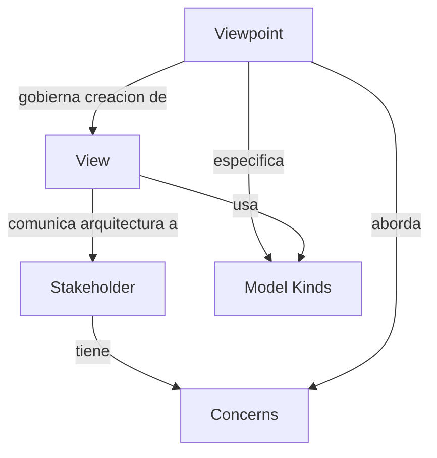

# Viewpoints y Views

**Tiempo estimado**: 25 minutos
**Nivel**: Intermedio
**Prerrequisitos**: Baseline vs Target Architecture (1.2.2)

---

## Por que importa este subtema?

Una arquitectura empresarial es demasiado compleja para representarse en un solo diagrama. Diferentes stakeholders tienen diferentes preguntas:

- El CFO pregunta: "Cual es el ROI?"
- El desarrollador pregunta: "Que APIs consumo?"
- El auditor pregunta: "Como se protegen los datos?"

Intentar responder todas estas preguntas en un solo documento genera confusion. Los viewpoints y views de TOGAF proporcionan un sistema para crear representaciones especificas para cada audiencia.

---

## Definiciones

### Viewpoint (Punto de Vista)

> "Una definicion de la perspectiva desde la cual se construye una vista. Especifica los stakeholders cuyas concerns se abordan, las convenciones de modelado, y los tipos de modelos usados."

**El viewpoint es como una PLANTILLA o RECETA**:
- Define para quien es la vista
- Define que preguntas responde
- Define que tipo de diagramas/modelos usar

### View (Vista)

> "Una representacion de un sistema desde la perspectiva de un conjunto relacionado de concerns."

**La view es el DOCUMENTO CONCRETO**:
- Una instancia de un viewpoint
- Contiene informacion especifica de tu arquitectura
- Se entrega a los stakeholders

### Analogia

```
VIEWPOINT : VIEW
    ::
RECETA DE COCINA : PLATO SERVIDO
    ::
PLANTILLA DE CURRICULUM : MI CURRICULUM

El viewpoint dice "que debe contener y como organizarlo"
La view es el producto final con contenido especifico
```

---

## Estructura de un Viewpoint

```
VIEWPOINT: [Nombre del Viewpoint]
=======================================

1. STAKEHOLDERS
   Lista de roles que usaran vistas de este tipo

2. CONCERNS
   Preguntas/intereses que la vista debe responder

3. MODEL KINDS
   Tipos de diagramas, matrices, o catalogos a usar

4. CONVENTIONS
   Notacion, colores, simbolos a emplear

5. SOURCES
   De donde obtener la informacion
```

---

## Viewpoints Comunes en TOGAF

### 1. Business Capability Viewpoint

```
VIEWPOINT: Business Capability
=======================================

STAKEHOLDERS:
  - CEO, CFO, COO
  - Business Unit Leaders
  - Strategy Team

CONCERNS:
  - Que capacidades tiene la organizacion?
  - Cuales son criticas para la estrategia?
  - Donde hay gaps o duplicacion?

MODEL KINDS:
  - Capability Map (mapa jerarquico)
  - Heat Map (capacidades + madurez/importancia)

CONVENTIONS:
  - Colores: Verde=Fortaleza, Amarillo=Adecuado, Rojo=Debil
  - Niveles: L1 (6-10), L2 (30-50), L3 (detalle)
```

### 2. Application Integration Viewpoint

```
VIEWPOINT: Application Integration
=======================================

STAKEHOLDERS:
  - Enterprise Architect
  - Solution Architects
  - Integration Team

CONCERNS:
  - Como se comunican las aplicaciones?
  - Donde hay dependencias criticas?
  - Que protocolos/tecnologias de integracion se usan?

MODEL KINDS:
  - Application Communication Diagram
  - Integration Matrix (App x App)

CONVENTIONS:
  - Lineas solidas: Sincrono
  - Lineas punteadas: Asincrono
  - Grosor: Volumen de transacciones
```

### 3. Technology Portfolio Viewpoint

```
VIEWPOINT: Technology Portfolio
=======================================

STAKEHOLDERS:
  - CIO, CTO
  - Enterprise Architect
  - Procurement

CONCERNS:
  - Que tecnologias usamos?
  - Cuales estan obsoletas o en riesgo?
  - Donde hay oportunidades de consolidacion?

MODEL KINDS:
  - Technology Catalog
  - Technology Lifecycle Matrix
  - Tech Radar

CONVENTIONS:
  - Estados: Strategic, Tactical, Containment, Retire
  - Colores por estado
```

---

## Ejemplo Completo: De Viewpoint a View

### Viewpoint Definido

```
VIEWPOINT: Data Flow Viewpoint
=======================================

STAKEHOLDERS:
  - Data Architect
  - Security Officer
  - Compliance Team

CONCERNS:
  - Como fluyen los datos entre sistemas?
  - Donde residen datos sensibles (PII, PCI)?
  - Hay transferencias cross-border?

MODEL KINDS:
  - Data Flow Diagram (DFD)
  - Data Classification Matrix

CONVENTIONS:
  - Datos sensibles: Borde rojo
  - Flujos encriptados: Linea verde
  - Flujos no encriptados: Linea roja punteada
```

### View Creada

```
VIEW: Data Flow View - Sistema de Clientes
==========================================

Fecha: 2026-01-28
Basado en: Data Flow Viewpoint
Arquitectura: Baseline

DIAGRAMA DE FLUJO DE DATOS
--------------------------

+-------------+     HTTPS/TLS      +-------------+
| Portal Web  | -----------------> | API Gateway |
| (Frontend)  |                    | (Kong)      |
+-------------+                    +------+------+
                                          |
                                   HTTPS/TLS
                                          |
                +-------------------------+-------------------------+
                |                         |                         |
                v                         v                         v
        +-------+-------+         +-------+-------+         +-------+-------+
        | Customer      |         | Order         |         | Payment       |
        | Service       |         | Service       |         | Service       |
        | [PII]         |         |               |         | [PCI]         |
        +-------+-------+         +-------+-------+         +-------+-------+
                |                         |                         |
                | TLS                     | TLS                     | TLS
                v                         v                         v
        +-------+-------+         +-------+-------+         +-------+-------+
        | PostgreSQL    |         | PostgreSQL    |         | Payment DB    |
        | Customers     |         | Orders        |         | (Tokenized)   |
        | [PII]         |         |               |         | [PCI]         |
        +---------------+         +---------------+         +---------------+

CONCERNS RESPONDIDAS
--------------------

1. Como fluyen los datos?
   - Todo el trafico externo pasa por API Gateway
   - Comunicacion interna via HTTPS/TLS
   - No hay flujos directos entre bases de datos

2. Donde residen datos sensibles?
   - PII: Customer Service + PostgreSQL Customers
   - PCI: Payment Service + Payment DB (tokenizado)

3. Transferencias cross-border?
   - No aplica (todo en AWS us-east-1)
   - Backup en us-west-2 (mismo pais)

HALLAZGOS
---------
- CONFORME: Todos los flujos encriptados
- RIESGO: PII en logs de Customer Service (remediacion requerida)
```

---

## Relacion View-Viewpoint-Concern-Stakeholder



---

## Mejores Practicas

### Al definir viewpoints

| Hacer | Evitar |
|-------|--------|
| Vincular a stakeholders especificos | Viewpoints genericos sin audiencia clara |
| Listar concerns como preguntas | Concerns vagos como "seguridad" |
| Especificar notacion exacta | "Cualquier diagrama que sirva" |
| Reutilizar viewpoints estandar | Reinventar para cada proyecto |

### Al crear views

| Hacer | Evitar |
|-------|--------|
| Referenciar viewpoint usado | Diagrama sin contexto |
| Responder explicitamente los concerns | Informacion irrelevante para la audiencia |
| Incluir fecha y version | Views sin control de versiones |
| Validar con stakeholders | Asumir que entenderan |

---

## Views en ArchiMate

TOGAF no define una notacion visual obligatoria. Muchas organizaciones complementan TOGAF con ArchiMate, que define viewpoints pre-construidos:

| Viewpoint ArchiMate | Equivalente TOGAF |
|---------------------|-------------------|
| Organization Viewpoint | Business Architecture - Organization |
| Application Cooperation | Application Integration |
| Technology Usage | Technology Architecture |
| Layered | Cross-cutting (todos los dominios) |

---

## Resumen

| Concepto | Definicion | Analogia |
|----------|------------|----------|
| **Viewpoint** | Plantilla que define como crear una vista | Receta de cocina |
| **View** | Documento concreto basado en un viewpoint | Plato servido |
| **Concern** | Pregunta/interes de un stakeholder | "Que ingredientes tiene?" |
| **Model Kind** | Tipo de diagrama/representacion | "Sera un plato frio" |

**Siguiente modulo**: El ADM - Ciclo Completo (Modulo 2)
