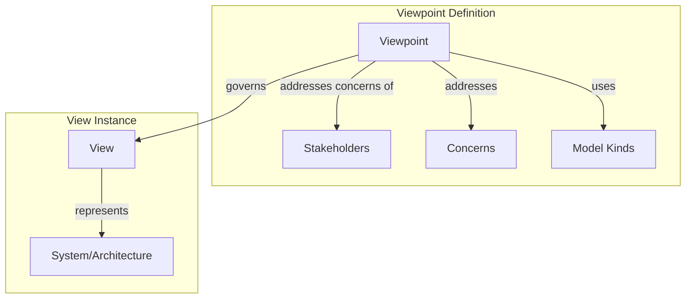
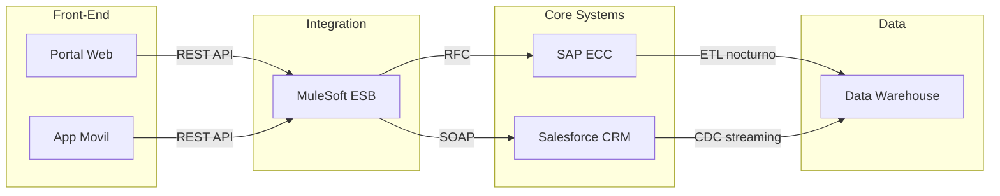
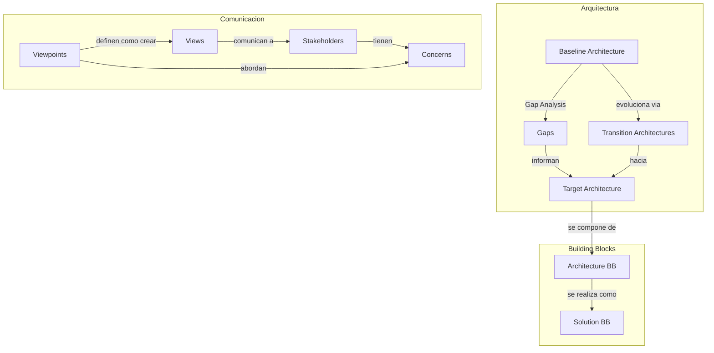

# Conceptos Fundamentales de TOGAF

**Tiempo estimado**: 60 minutos
**Nivel**: Intermedio
**Prerrequisitos**: Estructura del estandar TOGAF (Tema 1.1)

## Por que importa este concepto?

Antes de ejecutar cualquier fase del ADM, necesitas dominar el vocabulario y los conceptos que TOGAF utiliza de manera precisa. La terminologia de TOGAF no es decorativa: cada termino tiene una definicion especifica que afecta como se documenta, comunica y gobierna la arquitectura.

Cuando un arquitecto dice "baseline architecture" en una reunion, todos los participantes deben entender exactamente lo mismo. Si un stakeholder interpreta "baseline" como "lo que deberia ser" en lugar de "lo que es actualmente", las decisiones resultantes seran incorrectas. Esta precision terminologica es lo que permite que equipos distribuidos geograficamente trabajen de manera coordinada.

Ademas, los conceptos de views y viewpoints son fundamentales para la comunicacion efectiva. Un diagrama tecnico detallado que es perfecto para el equipo de infraestructura sera inutil para el CFO. TOGAF formaliza como crear representaciones apropiadas para cada audiencia.

## Conexion con conocimientos previos

En el tema anterior vimos la estructura general de TOGAF y sus cuatro pilares. Ahora profundizamos en los conceptos que sustentan esos pilares. Es como pasar de conocer las partes de un automovil (motor, transmision, frenos) a entender los principios fisicos que los hacen funcionar (combustion, friccion, hidraulica).

---

## Comprension intuitiva

### Arquitectura vs Diseno: La escala de las decisiones

Imagina que estas construyendo una ciudad:

- **Arquitectura**: Decide donde van las zonas residenciales, industriales y comerciales; por donde pasan las autopistas principales; donde se ubican las plantas de tratamiento de agua.
- **Diseno**: Decide el plano de cada edificio individual, el diseno de cada interseccion, los materiales de cada calle.

La arquitectura toma decisiones que:
1. Son costosas de cambiar una vez implementadas
2. Afectan a multiples sistemas o componentes
3. Tienen implicaciones a largo plazo
4. Requieren coordinacion entre multiples equipos

### Baseline vs Target: El mapa del viaje

Piensa en un GPS:
- **Baseline (estado actual)**: Tu ubicacion actual - "Estas aqui"
- **Target (estado objetivo)**: Tu destino - "Quieres llegar aqui"
- **Transition architectures**: Las paradas intermedias en un viaje largo
- **Roadmap**: La ruta con las indicaciones paso a paso

No puedes planificar un viaje sin saber donde estas ahora.

### Ejemplo motivador: El problema de los "muchos idiomas"

Una empresa tiene:
- Un arquitecto de datos que produce diagramas ER
- Un arquitecto de aplicaciones que produce diagramas UML
- Un arquitecto de infraestructura que produce diagramas de red
- Un arquitecto de negocio que produce mapas de procesos BPMN

El CEO pregunta: "Como impactara la nueva regulacion GDPR a nuestra empresa?"

Sin viewpoints y views estandarizados, cada arquitecto responde en su propio "idioma" y el CEO no puede tomar una decision informada. Con TOGAF, se crea una vista especifica para el CEO que muestra el impacto en terminos que el entiende: procesos de negocio afectados, riesgo financiero, timeline de cumplimiento.

---

## Definicion formal

### Arquitectura vs Diseno

**Arquitectura** (segun TOGAF):
> "La estructura fundamental de un sistema, incorporada en sus componentes, sus relaciones entre si y con el entorno, y los principios que gobiernan su diseno y evolucion."

**Diseno**:
> "La especificacion detallada de como se implementara cada componente arquitectonico, incluyendo algoritmos, estructuras de datos, interfaces, y comportamientos especificos."

**Criterios de distincion**:

| Caracteristica | Arquitectura | Diseno |
|----------------|--------------|--------|
| Alcance | Sistema completo / empresa | Componente individual |
| Horizonte temporal | Largo plazo (anos) | Corto/medio plazo (meses) |
| Costo de cambio | Alto | Moderado/Bajo |
| Tomador de decision | Arquitecto senior / Comite | Desarrollador / Tech lead |
| Nivel de abstraccion | Alto | Detallado |

### Baseline Architecture

**Definicion**:
> "La arquitectura existente. Una descripcion del estado actual de la arquitectura empresarial."

**Caracteristicas**:
- Documenta lo que **es**, no lo que deberia ser
- Incluye sistemas legados, deuda tecnica y workarounds
- Es el punto de partida obligatorio para cualquier transformacion
- Debe ser verificable contra la realidad operativa

**Componentes tipicos del baseline**:
```
Baseline Architecture
|
+-- Business Baseline
|   |-- Procesos actuales
|   |-- Estructura organizacional actual
|   |-- Capacidades existentes
|
+-- Data Baseline
|   |-- Modelos de datos actuales
|   |-- Flujos de datos existentes
|   |-- Calidad de datos actual
|
+-- Application Baseline
|   |-- Inventario de aplicaciones
|   |-- Integraciones existentes
|   |-- Estado de cada aplicacion (EOL, estable, etc.)
|
+-- Technology Baseline
    |-- Plataformas actuales
    |-- Infraestructura existente
    |-- Contratos con proveedores vigentes
```

### Target Architecture

**Definicion**:
> "La arquitectura objetivo. Una descripcion del estado futuro deseado de la arquitectura empresarial."

**Caracteristicas**:
- Representa la vision de lo que se quiere lograr
- Debe estar alineada con la estrategia de negocio
- Es el destino, pero puede evolucionar durante el viaje
- Debe ser alcanzable y medible

**Tipos de target architecture**:

| Tipo | Horizonte | Proposito |
|------|-----------|-----------|
| Strategic | 3-5 anos | Vision de largo plazo |
| Segment | 1-2 anos | Transformacion de un area especifica |
| Capability | 6-12 meses | Habilitacion de una capacidad particular |

### Gap Analysis

**Definicion**:
> "El proceso de identificar las diferencias entre la arquitectura baseline y la arquitectura target."

**Formula conceptual**:
```
Gap = Target Architecture - Baseline Architecture

Donde Gap puede incluir:
- Nuevos componentes a construir
- Componentes a retirar
- Componentes a modificar
- Nuevas relaciones a establecer
- Relaciones a eliminar
```

### Viewpoints y Views

**Viewpoint (Punto de Vista)**:
> "Una definicion de la perspectiva desde la cual se construye una vista. Especifica los stakeholders cuyas concerns se abordan, las convenciones de modelado, y los tipos de modelos usados."

**View (Vista)**:
> "Una representacion de un sistema desde la perspectiva de un conjunto relacionado de concerns. Una vista se construye de acuerdo a un viewpoint."

**Relacion**:
```
Viewpoint : View :: Plantilla : Documento

El viewpoint es la especificacion de como crear la vista.
La view es una instancia concreta de esa especificacion.
```

**Stakeholder Concerns**:
> "Los intereses, preocupaciones o preguntas que un stakeholder tiene respecto a la arquitectura."



---

## Implementacion practica

### Documentando Baseline vs Target

```python
# Estructura para documentar gap analysis

from dataclasses import dataclass
from enum import Enum
from typing import List, Optional

class GapType(Enum):
    NEW = "Nuevo componente a crear"
    RETIRE = "Componente a retirar"
    MODIFY = "Componente a modificar"
    KEEP = "Componente sin cambios"

@dataclass
class ArchitectureComponent:
    id: str
    name: str
    description: str
    domain: str  # Business, Data, Application, Technology

@dataclass
class Gap:
    component_baseline: Optional[ArchitectureComponent]
    component_target: Optional[ArchitectureComponent]
    gap_type: GapType
    impact: str
    effort_estimate: str
    dependencies: List[str]

def analyze_gaps(baseline: List[ArchitectureComponent],
                 target: List[ArchitectureComponent]) -> List[Gap]:
    """
    Identifica gaps entre arquitectura baseline y target.

    Args:
        baseline: Lista de componentes actuales
        target: Lista de componentes objetivo

    Returns:
        Lista de gaps identificados
    """
    gaps = []
    baseline_ids = {c.id for c in baseline}
    target_ids = {c.id for c in target}

    # Componentes nuevos (en target pero no en baseline)
    for comp in target:
        if comp.id not in baseline_ids:
            gaps.append(Gap(
                component_baseline=None,
                component_target=comp,
                gap_type=GapType.NEW,
                impact="Requiere desarrollo/adquisicion",
                effort_estimate="Por determinar",
                dependencies=[]
            ))

    # Componentes a retirar (en baseline pero no en target)
    for comp in baseline:
        if comp.id not in target_ids:
            gaps.append(Gap(
                component_baseline=comp,
                component_target=None,
                gap_type=GapType.RETIRE,
                impact="Requiere plan de decommission",
                effort_estimate="Por determinar",
                dependencies=[]
            ))

    # Componentes que permanecen (analizar si requieren modificacion)
    common_ids = baseline_ids & target_ids
    baseline_map = {c.id: c for c in baseline}
    target_map = {c.id: c for c in target}

    for cid in common_ids:
        b_comp = baseline_map[cid]
        t_comp = target_map[cid]

        if b_comp.description != t_comp.description:
            gaps.append(Gap(
                component_baseline=b_comp,
                component_target=t_comp,
                gap_type=GapType.MODIFY,
                impact="Requiere modificacion",
                effort_estimate="Por determinar",
                dependencies=[]
            ))
        else:
            gaps.append(Gap(
                component_baseline=b_comp,
                component_target=t_comp,
                gap_type=GapType.KEEP,
                impact="Sin cambios",
                effort_estimate="N/A",
                dependencies=[]
            ))

    return gaps

# Ejemplo de uso
baseline_apps = [
    ArchitectureComponent("APP001", "CRM Legacy", "Sistema CRM en Siebel", "Application"),
    ArchitectureComponent("APP002", "ERP", "SAP ECC 6.0", "Application"),
    ArchitectureComponent("APP003", "Portal Web", "Portal PHP legacy", "Application"),
]

target_apps = [
    ArchitectureComponent("APP001", "CRM Legacy", "Sistema CRM migrado a Salesforce", "Application"),
    ArchitectureComponent("APP002", "ERP", "SAP ECC 6.0", "Application"),  # Sin cambios
    ArchitectureComponent("APP004", "Portal Omnicanal", "Nueva app React + Node", "Application"),
]

gaps = analyze_gaps(baseline_apps, target_apps)
for gap in gaps:
    print(f"{gap.gap_type.value}: {gap.component_target or gap.component_baseline}")
```

### Definiendo Viewpoints

```python
@dataclass
class Concern:
    id: str
    description: str
    questions: List[str]  # Preguntas tipicas que este concern genera

@dataclass
class Stakeholder:
    id: str
    role: str
    concerns: List[str]  # IDs de concerns

@dataclass
class Viewpoint:
    id: str
    name: str
    stakeholders: List[str]  # IDs de stakeholders
    concerns: List[str]  # IDs de concerns
    model_kinds: List[str]  # Tipos de diagramas/modelos
    description: str

# Definicion de viewpoints comunes en TOGAF

stakeholders = {
    "CEO": Stakeholder("SH001", "CEO", ["C001", "C002"]),
    "CIO": Stakeholder("SH002", "CIO", ["C002", "C003", "C004"]),
    "ARCHITECT": Stakeholder("SH003", "Enterprise Architect", ["C003", "C004", "C005"]),
    "DEVELOPER": Stakeholder("SH004", "Development Team", ["C005", "C006"]),
}

concerns = {
    "C001": Concern("C001", "Impacto en ingresos", ["Como afecta esto a los ingresos?", "Cual es el ROI?"]),
    "C002": Concern("C002", "Alineacion estrategica", ["Soporta nuestra estrategia?", "Cuales son los riesgos?"]),
    "C003": Concern("C003", "Integracion de sistemas", ["Como se integra con sistemas existentes?"]),
    "C004": Concern("C004", "Costo total de propiedad", ["Cual es el TCO?", "Costos de mantenimiento?"]),
    "C005": Concern("C005", "Interfaces y APIs", ["Que interfaces expone?", "Que consume?"]),
    "C006": Concern("C006", "Stack tecnologico", ["Que tecnologias usa?", "Como se despliega?"]),
}

viewpoints = [
    Viewpoint(
        id="VP001",
        name="Business Capability Viewpoint",
        stakeholders=["SH001", "SH002"],
        concerns=["C001", "C002"],
        model_kinds=["Capability Map", "Value Stream Diagram"],
        description="Muestra capacidades de negocio y su alineacion con estrategia"
    ),
    Viewpoint(
        id="VP002",
        name="Application Integration Viewpoint",
        stakeholders=["SH002", "SH003"],
        concerns=["C003", "C004"],
        model_kinds=["Application Communication Diagram", "Integration Matrix"],
        description="Muestra como las aplicaciones se comunican entre si"
    ),
    Viewpoint(
        id="VP003",
        name="Technology Stack Viewpoint",
        stakeholders=["SH003", "SH004"],
        concerns=["C005", "C006"],
        model_kinds=["Technology Portfolio Diagram", "Deployment Diagram"],
        description="Muestra la infraestructura y stack tecnologico"
    ),
]
```

### Creando Views a partir de Viewpoints

```markdown
# Ejemplo: Application Integration View

## Metadatos de la Vista
- **Viewpoint aplicado**: Application Integration Viewpoint (VP002)
- **Stakeholders objetivo**: CIO, Enterprise Architect
- **Concerns abordados**: Integracion de sistemas, Costo total de propiedad
- **Fecha de creacion**: 2026-01-28
- **Version**: 1.0

## Diagrama de Comunicacion de Aplicaciones



## Matriz de Integracion

| Origen | Destino | Protocolo | Frecuencia | Volumen |
|--------|---------|-----------|------------|---------|
| Portal Web | ESB | REST/HTTPS | Tiempo real | 10K req/min |
| App Movil | ESB | REST/HTTPS | Tiempo real | 5K req/min |
| ESB | Salesforce | SOAP/HTTPS | Tiempo real | 2K req/min |
| ESB | SAP | RFC | Tiempo real | 1K req/min |
| SAP | DW | JDBC/ETL | Batch nocturno | 50M registros |
| Salesforce | DW | Kafka/CDC | Streaming | 100K eventos/hora |

## Concerns Abordados

### C003: Integracion de sistemas
- Todas las integraciones pasan por el ESB centralizado
- No hay integraciones punto-a-punto no gobernadas
- Protocolos estandarizados por tipo de sistema

### C004: Costo total de propiedad
- Licencias ESB: $200K/ano
- Mantenimiento integraciones: 2 FTE
- Costo estimado por integracion nueva: $15K
```

---

## Errores frecuentes

### Error 1: Baseline idealizado

**Problema**: Documentar el baseline como "deberia ser" en lugar de como realmente es.

```
INCORRECTO:
Baseline: "Sistema CRM con datos de clientes limpios y actualizados"

CORRECTO:
Baseline: "Sistema CRM Siebel v8.1 con 40% de registros duplicados,
          sin integracion con call center, datos de contacto
          desactualizados en 30% de los casos"
```

**Por que importa**: Si el baseline esta idealizado, el gap analysis sera incorrecto y el roadmap sera irrealista.

### Error 2: Views sin viewpoint definido

**Problema**: Crear diagramas ad-hoc sin especificar para quien son ni que concerns abordan.

```
INCORRECTO:
[Diagrama tecnico detallado enviado al CEO]

CORRECTO:
1. Identificar stakeholder: CEO
2. Identificar concerns: Impacto financiero, riesgo estrategico
3. Seleccionar viewpoint apropiado: Business Capability Viewpoint
4. Crear view: Mapa de capacidades con indicadores de impacto
```

### Error 3: Confundir ABB con SBB

**Architecture Building Block (ABB)**:
- Nivel conceptual
- Define capacidad requerida
- Ejemplo: "Servicio de autenticacion de usuarios"

**Solution Building Block (SBB)**:
- Nivel de implementacion
- Producto/tecnologia especifica
- Ejemplo: "Okta Identity Cloud + Azure AD B2C"

```
INCORRECTO:
ABB: "Okta para autenticacion"  # Esto es un SBB

CORRECTO:
ABB: "Servicio de autenticacion que soporte SSO, MFA y federacion"
SBB: "Okta Identity Cloud" (seleccionado en Fase E del ADM)
```

---

## Visualizacion del concepto

### Relacion entre conceptos clave



### Jerarquia de abstraccion

```
        ALTO NIVEL DE ABSTRACCION
                  ^
                  |
    +-------------+-------------+
    | Vision de Arquitectura    |  <-- Que queremos lograr
    +---------------------------+
                  |
    +-------------+-------------+
    | Target Architecture       |  <-- Que necesitamos construir (conceptual)
    | (Architecture BBs)        |
    +---------------------------+
                  |
    +-------------+-------------+
    | Solution Architecture     |  <-- Como lo construiremos (productos)
    | (Solution BBs)            |
    +---------------------------+
                  |
    +-------------+-------------+
    | Diseno Detallado          |  <-- Especificaciones de implementacion
    +---------------------------+
                  |
                  v
        BAJO NIVEL DE ABSTRACCION
```

---

## Aplicaciones reales

### Caso: Gap Analysis en migracion bancaria

Un banco documenta su baseline de core bancario:
- 47 aplicaciones en mainframe COBOL
- 12 bases de datos IMS/DB2
- 200+ interfaces batch entre sistemas
- 15 anos de deuda tecnica acumulada

Target architecture:
- 15 microservicios en Kubernetes
- 3 bases de datos PostgreSQL
- Event-driven architecture con Kafka
- APIs RESTful estandarizadas

Gap analysis revela:
- 32 aplicaciones a retirar (funcionalidad absorbida)
- 15 aplicaciones a transformar en microservicios
- 180 interfaces batch a convertir en eventos
- 12 interfaces a mantener para sistemas externos legacy

Este gap analysis informa el roadmap de 3 anos con 4 transition architectures.

---

## Resumen del concepto

**Arquitectura vs Diseno**: La arquitectura define decisiones de alto impacto y largo plazo; el diseno detalla la implementacion de componentes individuales.

**Baseline vs Target**: El baseline es donde estas, el target es donde quieres ir, y el gap analysis te dice que falta.

**Viewpoints y Views**: Los viewpoints definen como comunicar arquitectura a diferentes audiencias; las views son instancias concretas de esa comunicacion.

**Prerequisito critico**: Dominar estos conceptos antes de ejecutar cualquier fase del ADM.

**Siguiente paso**: Aplicar estos conceptos en el ciclo del ADM (Modulo 2).
