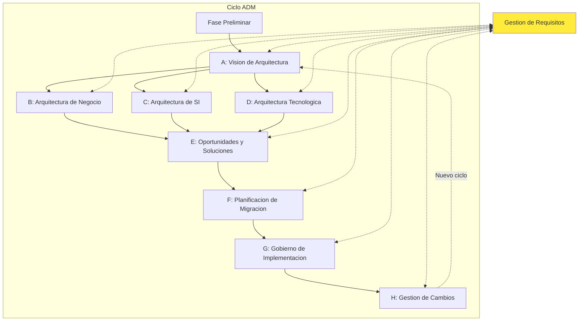
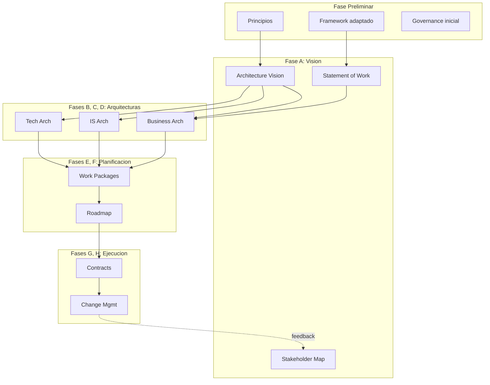

# Vision General del ADM

**Tiempo estimado**: 90 minutos
**Nivel**: Intermedio
**Prerrequisitos**: Estructura del estandar TOGAF, Conceptos fundamentales (Modulo 1)

## Por que importa este concepto?

El Architecture Development Method (ADM) es el corazon de TOGAF. Sin el ADM, TOGAF seria simplemente un glosario de terminos y una coleccion de plantillas. El ADM es lo que transforma TOGAF de un marco teorico a una herramienta practica que guia la creacion de arquitectura empresarial de principio a fin.

Entender el ADM te permite responder preguntas criticas: "Por donde empiezo?", "Que debo producir en cada etapa?", "Como se que avance correctamente?". Muchos proyectos de arquitectura empresarial fracasan no por falta de conocimiento tecnico, sino por falta de un proceso estructurado. El ADM proporciona ese proceso.

Ademas, el ADM no es un proceso rigido: esta disenado para ser adaptado. Pero para adaptar algo efectivamente, primero debes entenderlo en su forma completa.

## Conexion con conocimientos previos

En el Modulo 1 vimos que TOGAF tiene cuatro pilares y que el ADM es el proceso central. Ahora profundizamos en como funciona ese proceso, sus fases, y como se relacionan entre si.

---

## Comprension intuitiva

### El ADM como ciclo de mejora continua

Piensa en el ADM como el ciclo de desarrollo de un producto de software, pero a escala empresarial:

| Desarrollo Agil | ADM de TOGAF |
|-----------------|--------------|
| Discovery/Research | Fase Preliminar + Fase A |
| Design | Fases B, C, D |
| Planning | Fases E, F |
| Implementation | Fase G |
| Maintenance | Fase H |

La diferencia clave: mientras un sprint de desarrollo dura 2 semanas, un ciclo del ADM puede durar meses o anos, dependiendo del alcance.

### El ADM no es una cascada

Un error comun es pensar que el ADM es un proceso waterfall donde completas una fase antes de iniciar la siguiente. En realidad:

```
       NO es asi:                    SI es asi:

    [Preliminar]                   [Preliminar]
         |                              |
         v                              v
    [Fase A] ------>              [Fase A] <----+
         |                              |       |
         v                              v       |
    [Fase B] ------>              [Fase B] <--+ |
         |                              |     | |
         v                              v     | |
    [Fase C] ------>              [Fase C]----+ |
         |                              |       |
        ...                            ...------+
```

El ADM permite y espera iteraciones, revisiones y ajustes basados en descubrimientos durante el proceso.

### Ejemplo motivador

Una empresa de seguros quiere digitalizar su proceso de reclamos. Sin ADM:

1. El equipo de TI construye una app movil para reportar reclamos
2. Descubren que el sistema de suscripcion no puede recibir datos de la app
3. Construyen una integracion ad-hoc
4. Regulacion requiere trazabilidad que no existe
5. Construyen otro parche
6. El sistema se vuelve inmantenible en 2 anos

Con ADM:
1. **Fase A**: Vision de "Reclamos Digitales 360" aprobada por comite
2. **Fase B**: Se mapean todos los procesos de reclamos y sus dependencias
3. **Fase C**: Se disena arquitectura de datos con trazabilidad desde el inicio
4. **Fase C**: Se define arquitectura de apps incluyendo integracion con suscripcion
5. **Fase D**: Se especifica infraestructura cloud con compliance incorporado
6. **Fase E-F**: Se planifica implementacion en 3 fases
7. **Fase G-H**: Se gobierna y evoluciona de manera controlada

---

## Definicion formal

### El ADM: Definicion

> "El Architecture Development Method (ADM) es un metodo para desarrollar y gestionar el ciclo de vida de una arquitectura empresarial. Es el nucleo de TOGAF y un metodo confiable y probado para desarrollar arquitectura de TI que satisface las necesidades del negocio."

### Caracteristicas del ADM

1. **Iterativo**: Dentro de fases, entre fases, y entre ciclos completos
2. **Basado en mejores practicas**: Destilado de experiencias de cientos de organizaciones
3. **Modular**: Puede adoptarse completo o por partes
4. **Adaptable**: Debe ser ajustado al contexto organizacional
5. **Orientado a entregables**: Cada fase produce outputs especificos

### Estructura del Ciclo ADM



### Fases del ADM: Resumen

| Fase | Nombre | Proposito | Output Principal |
|------|--------|-----------|------------------|
| Preliminar | Framework y Principios | Preparar organizacion y adaptar TOGAF | Principles Catalog, Tailored Architecture Framework |
| A | Vision de Arquitectura | Establecer proyecto y obtener aprobacion | Architecture Vision, Statement of Architecture Work |
| B | Arquitectura de Negocio | Desarrollar arq. de negocio baseline y target | Business Architecture Document |
| C | Arquitectura de SI | Desarrollar arq. de datos y aplicaciones | Data and Application Architecture Documents |
| D | Arquitectura Tecnologica | Desarrollar arq. de tecnologia | Technology Architecture Document |
| E | Oportunidades y Soluciones | Planificacion inicial de implementacion | Implementation and Migration Strategy |
| F | Planificacion de Migracion | Plan detallado de implementacion | Architecture Roadmap, Migration Plan |
| G | Gobierno de Implementacion | Supervision arquitectonica de implementacion | Architecture Contract, Compliance Assessments |
| H | Gestion de Cambios | Gestion continua de cambios | Change Requests, Updated Requirements |
| RM | Gestion de Requisitos | Gestionar requisitos a lo largo del ciclo | Requirements Repository |

### Gestion de Requisitos: El Centro del Ciclo

La Gestion de Requisitos no es una fase secuencial sino un proceso central que:

- Opera continuamente durante todas las fases
- Mantiene un repositorio vivo de requisitos
- Asegura trazabilidad entre requisitos y arquitectura
- Gestiona cambios en requisitos durante el ciclo

```
Fase Activa ---[genera requisitos]---> Gestion de Requisitos
                                              |
Fase Activa <--[requisitos priorizados]-------+
```

---

## Implementacion practica

### Estructura de inputs y outputs

```python
from dataclasses import dataclass
from typing import List, Dict
from enum import Enum

class ADMPhase(Enum):
    PRELIMINARY = "Preliminary"
    PHASE_A = "A - Architecture Vision"
    PHASE_B = "B - Business Architecture"
    PHASE_C = "C - Information Systems Architecture"
    PHASE_D = "D - Technology Architecture"
    PHASE_E = "E - Opportunities and Solutions"
    PHASE_F = "F - Migration Planning"
    PHASE_G = "G - Implementation Governance"
    PHASE_H = "H - Architecture Change Management"

@dataclass
class ADMPhaseSpec:
    phase: ADMPhase
    objectives: List[str]
    inputs: List[str]
    outputs: List[str]
    steps: List[str]

# Especificacion de Fase A como ejemplo
phase_a_spec = ADMPhaseSpec(
    phase=ADMPhase.PHASE_A,
    objectives=[
        "Desarrollar vision de alto nivel de capacidades y valor de negocio",
        "Obtener aprobacion para Statement of Architecture Work",
        "Definir alcance, restricciones y expectativas",
        "Crear Architecture Vision"
    ],
    inputs=[
        "Architecture Reference Materials",
        "Request for Architecture Work",
        "Business principles, goals, and drivers",
        "Organizational Model for Enterprise Architecture",
        "Tailored Architecture Framework",
        "Populated Architecture Repository"
    ],
    outputs=[
        "Approved Statement of Architecture Work",
        "Refined statements of business principles, goals, drivers",
        "Architecture Vision",
        "Draft Architecture Definition Document",
        "Communications Plan",
        "Additional content in Architecture Repository"
    ],
    steps=[
        "1. Establecer el proyecto de arquitectura",
        "2. Identificar stakeholders, concerns y requisitos de negocio",
        "3. Confirmar y elaborar business goals, drivers y restricciones",
        "4. Evaluar capacidades de negocio",
        "5. Evaluar readiness para transformacion de negocio",
        "6. Definir alcance",
        "7. Confirmar y elaborar Architecture Principles",
        "8. Desarrollar Architecture Vision",
        "9. Definir proposiciones de valor de Target Architecture",
        "10. Identificar riesgos de transformacion y actividades de mitigacion",
        "11. Desarrollar Statement of Architecture Work y asegurar aprobacion"
    ]
)

def get_phase_dependencies() -> Dict[ADMPhase, List[ADMPhase]]:
    """Define dependencias entre fases del ADM"""
    return {
        ADMPhase.PRELIMINARY: [],
        ADMPhase.PHASE_A: [ADMPhase.PRELIMINARY],
        ADMPhase.PHASE_B: [ADMPhase.PHASE_A],
        ADMPhase.PHASE_C: [ADMPhase.PHASE_A],  # B y C pueden ser paralelas
        ADMPhase.PHASE_D: [ADMPhase.PHASE_A],  # B, C, D pueden ser paralelas
        ADMPhase.PHASE_E: [ADMPhase.PHASE_B, ADMPhase.PHASE_C, ADMPhase.PHASE_D],
        ADMPhase.PHASE_F: [ADMPhase.PHASE_E],
        ADMPhase.PHASE_G: [ADMPhase.PHASE_F],
        ADMPhase.PHASE_H: [ADMPhase.PHASE_G],
    }
```

### Adaptando el ADM

```python
@dataclass
class ADMTailoring:
    """Configuracion para adaptar el ADM al contexto organizacional"""
    organization_size: str  # "small", "medium", "large"
    architecture_maturity: str  # "initial", "developing", "established"
    scope: str  # "enterprise", "segment", "capability"
    time_constraint: str  # "weeks", "months", "years"

    def get_recommended_adaptations(self) -> List[str]:
        adaptations = []

        # Adaptaciones por tamano
        if self.organization_size == "small":
            adaptations.append("Combinar fases B, C, D en una sola iteracion")
            adaptations.append("Simplificar entregables a documentos esenciales")
            adaptations.append("Reducir formalidad de governance")

        # Adaptaciones por madurez
        if self.architecture_maturity == "initial":
            adaptations.append("Enfocarse en Preliminary y Fase A en primer ciclo")
            adaptations.append("Establecer baseline antes de definir targets ambiciosos")
            adaptations.append("Invertir en capacitacion y change management")

        # Adaptaciones por alcance
        if self.scope == "capability":
            adaptations.append("Omitir Fase Preliminar si ya existe framework")
            adaptations.append("Fase A puede ser un workshop de 2 dias")
            adaptations.append("Fases B-D pueden ejecutarse en semanas")

        # Adaptaciones por tiempo
        if self.time_constraint == "weeks":
            adaptations.append("Usar Architecture Sprint approach")
            adaptations.append("Producir solo entregables minimos viables")
            adaptations.append("Revisiones ligeras en lugar de governance formal")

        return adaptations

# Ejemplo
context = ADMTailoring(
    organization_size="medium",
    architecture_maturity="developing",
    scope="segment",
    time_constraint="months"
)

print("Adaptaciones recomendadas:")
for adaptation in context.get_recommended_adaptations():
    print(f"  - {adaptation}")
```

### Iteraciones del ADM

TOGAF define varios niveles de iteracion:

```
NIVEL 1: Iteracion dentro de una fase
+-----------------------------------------+
| Fase B: Arquitectura de Negocio         |
|                                         |
|   Iteration 1: Capability Map Draft     |
|        |                                |
|        v                                |
|   Review with stakeholders              |
|        |                                |
|        v                                |
|   Iteration 2: Refined Capability Map   |
|        |                                |
|        v                                |
|   Final Baseline + Target               |
+-----------------------------------------+

NIVEL 2: Iteracion entre fases (regresar a fase anterior)
+-------+     +-------+     +-------+
|Fase A | --> |Fase B | --> |Fase C |
+-------+     +-------+     +-------+
                  ^             |
                  |             |
                  +-------------+
                  Descubrimiento en C
                  requiere ajustar B

NIVEL 3: Iteracion del ciclo completo
+-------------------------------------------+
|             Ciclo 1: Strategic            |
| Preliminar -> A -> B -> C -> D -> E -> F  |
+-------------------------------------------+
                    |
                    v
+-------------------------------------------+
|          Ciclo 2: Segment (Marketing)     |
|         A -> B -> C -> D -> E -> F -> G   |
+-------------------------------------------+
                    |
                    v
+-------------------------------------------+
|        Ciclo 3: Capability (CRM)          |
|              A -> C -> E -> F -> G        |
+-------------------------------------------+
```

---

## Errores frecuentes

### Error 1: Ejecutar ADM como waterfall estricto

**Problema**: Completar Fase B 100% antes de iniciar Fase C.

**Consecuencia**: Ciclos de 18+ meses donde el contexto de negocio cambia antes de completar la arquitectura.

**Solucion**: Usar timeboxing e iteraciones. Ejemplo:
- Fase A: 2 semanas
- Fases B, C, D: 4 semanas en paralelo (80% completitud)
- Fase E: 2 semanas
- Refinar B, C, D segun hallazgos de E
- Continuar con F, G

### Error 2: Omitir la Fase Preliminar

**Problema**: Saltar directamente a Fase A sin establecer el framework y principios.

**Consecuencia**:
- Cada proyecto de arquitectura reinventa la rueda
- No hay consistencia entre diferentes iniciativas
- No hay governance establecido

**Solucion**: La Fase Preliminar se ejecuta una vez (o se actualiza periodicamente) y establece las bases para multiples ciclos del ADM.

### Error 3: Tratar Requirements Management como fase secuencial

**Problema**: Documentar requisitos una vez al inicio y no actualizarlos.

**Consecuencia**: Arquitectura desalineada con necesidades reales que evolucionan.

**Solucion**: Requirements Management es un proceso continuo:
- Capturar nuevos requisitos en cualquier fase
- Evaluar impacto de cambios en requisitos
- Mantener trazabilidad bidireccional

---

## Visualizacion del concepto

### Flujo de informacion entre fases



### Timeline tipico por tipo de proyecto

```
PROYECTO ESTRATEGICO (12-18 meses)
|--Prel--|---A---|-----B-----|-----C-----|-----D-----|---E---|---F---|---G/H--->
  1 mes    2 mes     3 mes       3 mes       3 mes     2 mes   2 mes   continuo

PROYECTO DE SEGMENTO (4-6 meses)
|--A--|---BCD---|---E---|---F---|---G/H--->
 2 sem   6 sem    2 sem   2 sem   continuo

PROYECTO DE CAPACIDAD (6-12 semanas)
|--A--|--BCD--|--EF--|--G-->
 1 sem  4 sem  2 sem  continuo
```

---

## Aplicaciones reales

### Caso: Banco implementa Open Banking

**Contexto**: Regulacion PSD2 requiere APIs abiertas en 18 meses

**Aplicacion del ADM**:

| Fase | Duracion | Actividad Principal |
|------|----------|---------------------|
| Preliminar | Ya existia | Adaptar principios para APIs abiertas |
| A | 3 semanas | Vision "Open Banking Platform", sponsor del board |
| B | 4 semanas | Mapear servicios bancarios a exponer, procesos de consentimiento |
| C | 6 semanas | Disenar APIs, modelo de datos para Third Party Providers |
| D | 4 semanas | Seleccionar API Gateway, seguridad OAuth2/OpenID |
| E | 3 semanas | Evaluar build vs buy para componentes |
| F | 2 semanas | Roadmap: Fase 1 (consulta), Fase 2 (pagos), Fase 3 (productos) |
| G | 12 meses | Governance durante implementacion |
| H | Continuo | Adaptacion a actualizaciones regulatorias |

**Resultado**: Compliance alcanzado 2 meses antes del deadline, plataforma reutilizada para iniciativas BaaS.

---

## Resumen del concepto

**En una frase**: El ADM es un ciclo iterativo de 8 fases (+Preliminar +RM) que guia el desarrollo de arquitectura empresarial desde la vision hasta la gestion continua.

**Estructura basica**: Preliminar → A (Vision) → B/C/D (Arquitecturas de dominio) → E/F (Planificacion) → G/H (Ejecucion y cambios)

**Principio clave**: No es waterfall; es iterativo y adaptable al contexto.

**Prerequisito critico**: Entender los conceptos fundamentales de TOGAF (Modulo 1)

**Siguiente paso**: Profundizar en Fase Preliminar y Fase A (Temas 2.2 y 2.3)
