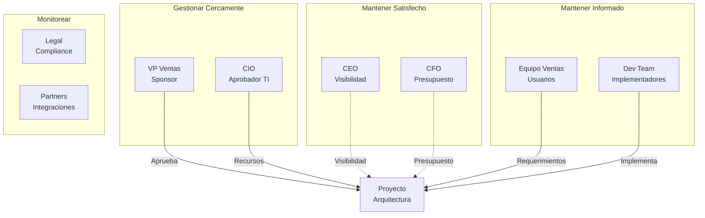

# Stakeholder Management

**Tiempo estimado**: 25 minutos
**Nivel**: Intermedio
**Prerrequisitos**: Request for Architecture Work (2.3.1)

---

## Por que importa este subtema?

La arquitectura mas tecnicamente perfecta es inutil si no tiene el apoyo de los stakeholders correctos. Muchos proyectos de arquitectura fracasan no por problemas tecnicos, sino por:

- No involucrar a stakeholders clave
- Comunicar de manera inadecuada
- Ignorar concerns politicos u organizacionales

La gestion de stakeholders es una actividad critica de la **Fase A** que continua durante todo el ADM.

---

## Que es un Stakeholder

> "Un individuo, equipo, organizacion, o clase de estos, que tiene un interes en un sistema."

**Tipos de interes**:
- **Positivo**: Se beneficia del exito del proyecto
- **Negativo**: Podria ser afectado adversamente
- **Neutral**: No afectado pero tiene influencia

---

## Proceso de Gestion de Stakeholders

```
1. IDENTIFICAR
   Quienes son los stakeholders?
         |
         v
2. CLASIFICAR
   Cual es su poder e interes?
         |
         v
3. ANALIZAR
   Cuales son sus concerns?
         |
         v
4. PLANIFICAR
   Como los involucraremos?
         |
         v
5. GESTIONAR
   Ejecutar el plan de comunicacion
         |
         v
6. MONITOREAR
   Ajustar segun feedback
```

---

## 1. Identificar Stakeholders

### Categorias tipicas

| Categoria | Ejemplos |
|-----------|----------|
| **Ejecutivos** | CEO, CFO, CIO, Board |
| **Negocio** | VPs, Directores, Gerentes de producto |
| **TI** | CTOs, Arquitectos, Desarrolladores, Ops |
| **Usuarios** | Empleados que usan sistemas, Clientes |
| **Externos** | Reguladores, Partners, Proveedores |
| **Proyecto** | PMO, Project Managers |

### Preguntas para identificar

- Quien se beneficia del exito?
- Quien podria oponerse?
- Quien tiene poder de decision?
- Quien controla recursos (dinero, personas)?
- Quien sera afectado por los cambios?
- Quien tiene conocimiento critico?

---

## 2. Clasificar Stakeholders

### Matriz Poder-Interes

```
              INTERES
              Bajo              Alto
        +------------+------------+
   Alto | MANTENER   | GESTIONAR  |
PODER   | SATISFECHO | CERCAMENTE |
        +------------+------------+
   Bajo | MONITOREAR | MANTENER   |
        | (MINIMO)   | INFORMADO  |
        +------------+------------+

GESTIONAR CERCAMENTE: Sponsor, CIO, usuarios clave
MANTENER SATISFECHO: CFO, Legal, Compliance
MANTENER INFORMADO: Usuarios finales, equipos de desarrollo
MONITOREAR: Stakeholders perifericos
```

### Ejemplo de clasificacion

| Stakeholder | Poder | Interes | Cuadrante |
|-------------|-------|---------|-----------|
| CEO | Alto | Bajo | Mantener Satisfecho |
| CIO | Alto | Alto | Gestionar Cercamente |
| VP Ventas (sponsor) | Alto | Alto | Gestionar Cercamente |
| Equipo desarrollo | Bajo | Alto | Mantener Informado |
| Usuarios finales | Bajo | Alto | Mantener Informado |
| Legal | Medio | Bajo | Monitorear |

---

## 3. Analizar Concerns

Cada stakeholder tiene preocupaciones especificas:

| Stakeholder | Concerns tipicos |
|-------------|------------------|
| **CEO** | ROI, riesgo estrategico, reputacion |
| **CFO** | Costos, presupuesto, TCO |
| **CIO** | Alineacion TI, recursos, timeline |
| **VP Negocio** | Funcionalidad, usabilidad, adopcion |
| **Arquitecto** | Calidad tecnica, mantenibilidad |
| **Desarrollador** | Claridad de requerimientos, tecnologia |
| **Usuario** | Facilidad de uso, impacto en trabajo |
| **Compliance** | Regulaciones, auditoria, controles |

### Documentando concerns

```markdown
## Stakeholder: VP Ventas (Maria Lopez)

### Concerns
1. **Tiempo de cotizacion**: "Necesitamos responder mas rapido que la competencia"
2. **Exactitud de precios**: "No podemos permitir errores que cuesten dinero"
3. **Adopcion**: "Mi equipo es resistente al cambio, debe ser facil de usar"

### Preguntas clave
- Cual es el tiempo de cotizacion aceptable?
- Que nivel de error es tolerable?
- Que capacitacion se requerira?

### Criterios de exito
- Cotizaciones en <24 horas
- 0 errores de pricing
- 90% de adopcion en 3 meses
```

---

## 4. Plan de Comunicacion

### Matriz de comunicacion

| Stakeholder | Metodo | Frecuencia | Contenido | Responsable |
|-------------|--------|------------|-----------|-------------|
| CEO | Executive summary | Mensual | Estado, riesgos, decisiones | Lead Architect |
| CIO | Reunion 1:1 | Semanal | Progreso tecnico, bloqueos | Lead Architect |
| VP Ventas | Steering committee | Quincenal | Demo, feedback, decisiones | PM + Architect |
| Dev team | Stand-up | Diario | Tareas, impedimentos | Tech Lead |
| Usuarios | Newsletter | Mensual | Avances, preview, training | Change Manager |

### Template de comunicacion por audiencia

```
EJECUTIVOS (CEO, CFO):
- Formato: 1 pagina, bullets
- Contenido: Progreso vs plan, presupuesto, riesgos top 3, decisiones requeridas
- Evitar: Detalles tecnicos, jerga

TECNICOS (CIO, Arquitectos):
- Formato: Presentacion tecnica, diagramas
- Contenido: Decisiones arquitectonicas, trade-offs, alternativas evaluadas
- Evitar: Marketing speak, generalidades

USUARIOS:
- Formato: Visual, screenshots, video
- Contenido: Que cambiara, cuando, como prepararse
- Evitar: Complejidad tecnica, incertidumbre
```

---

## 5. Tecnicas de Gestion

### Para stakeholders resistentes

| Situacion | Tecnica |
|-----------|---------|
| "No tengo tiempo" | Reuniones cortas, comunicacion asincrona |
| "Esto no me afecta" | Mostrar impacto concreto |
| "Ya probamos y no funciono" | Entender que fallo antes, diferenciar |
| "Mi sistema funciona bien" | Mostrar beneficios, no solo cambios |
| Conflicto entre stakeholders | Escalar a sponsor, buscar win-win |

### Para stakeholders influyentes

| Situacion | Tecnica |
|-----------|---------|
| Quiere imponer solucion | Evaluar objetivamente, mostrar trade-offs |
| Cambia de opinion frecuente | Documentar decisiones, proceso de cambio |
| Tiene agenda oculta | Identificar, alinear con objetivos del proyecto |

---

## Stakeholder Map



---

## Resumen

| Paso | Actividad | Output |
|------|-----------|--------|
| Identificar | Listar todos los stakeholders | Lista de stakeholders |
| Clasificar | Evaluar poder e interes | Matriz poder-interes |
| Analizar | Documentar concerns | Concern catalog |
| Planificar | Definir comunicacion | Communication plan |
| Gestionar | Ejecutar plan | Relaciones efectivas |
| Monitorear | Ajustar segun feedback | Plan actualizado |

**Siguiente subtema**: Architecture Vision Document (2.3.3)
