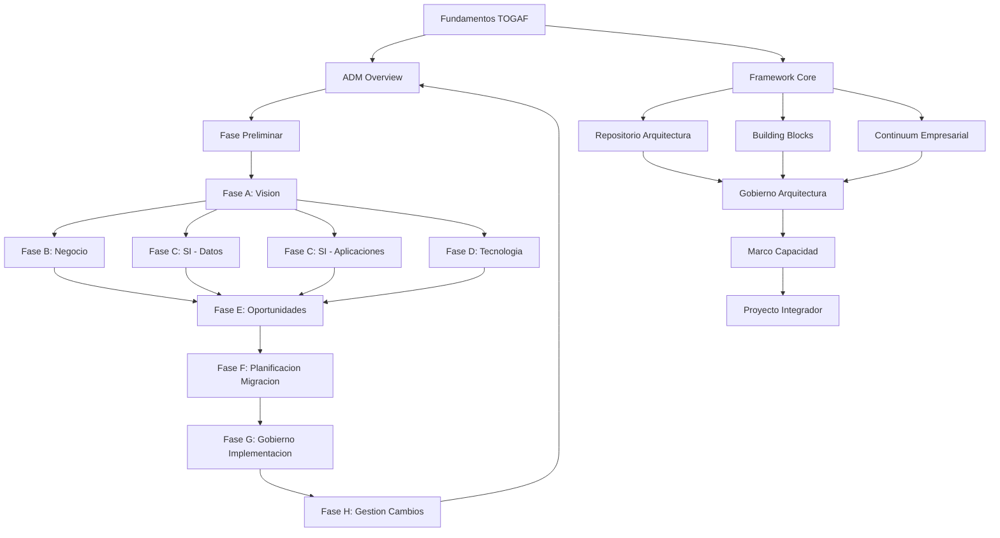

# ARQUITECTURA CURRICULAR: DOMINAR EL ESTANDAR TOGAF

## METADATA

- **Complejidad**: Intermedio-Avanzado
- **Duracion estimada**: 45-60 horas
- **Audiencia objetivo**: Arquitectos empresariales, profesionales de TI, consultores, lideres tecnicos
- **Prerrequisitos obligatorios**:
  1. Conocimiento basico de estructuras organizacionales de TI
  2. Experiencia minima de 2 anos en roles tecnicos o de gestion
  3. Familiaridad con conceptos de desarrollo de software
  4. Comprension basica de procesos de negocio
- **Fecha de diseno**: 2026-01-28

---

## MAPA CONCEPTUAL



---

## OBJETIVOS GENERALES DEL CURSO

1. **Aplicar** el ciclo completo del ADM (Architecture Development Method) para disenar arquitecturas empresariales alineadas con objetivos de negocio.
2. **Disenar** arquitecturas en los cuatro dominios TOGAF (Negocio, Datos, Aplicaciones, Tecnologia) siguiendo las mejores practicas del estandar.
3. **Implementar** estructuras de gobierno de arquitectura que aseguren la conformidad y evolucion controlada.
4. **Evaluar** y seleccionar Building Blocks apropiados utilizando el Enterprise Continuum como guia.
5. **Crear** entregables profesionales de arquitectura que cumplan con los estandares de documentacion TOGAF.

---

## ESTRUCTURA MODULAR

### MODULO 0: Diagnostico y Nivelacion

**Duracion**: 3 horas
**Objetivo**: Validar prerrequisitos y establecer linea base de conocimientos en arquitectura empresarial

#### Ruta Basica

- **Concepto 0.1**: Introduccion a la Arquitectura Empresarial
  - Objetivo especifico: Definir que es arquitectura empresarial y su valor para las organizaciones
  - Tiempo estimado: 45 minutos
  - Tipo: Teorico

- **Concepto 0.2**: Roles y Responsabilidades del Arquitecto
  - Objetivo especifico: Identificar las funciones y habilidades requeridas de un arquitecto empresarial
  - Tiempo estimado: 30 minutos
  - Tipo: Teorico

- **Concepto 0.3**: Panorama de Frameworks de AE
  - Objetivo especifico: Comparar TOGAF con otros frameworks (Zachman, FEAF, DoDAF)
  - Tiempo estimado: 45 minutos
  - Tipo: Teorico

- **Concepto 0.4**: Evaluacion Diagnostica
  - Objetivo especifico: Medir conocimientos previos y asignar ruta de aprendizaje
  - Tiempo estimado: 60 minutos
  - Tipo: Practico

#### Ruta Intermedia

- Omitir conceptos 0.1 y 0.2
- Enfocarse en comparativa de frameworks (45 min)
- Evaluacion diagnostica reducida (30 min)

#### Ruta Avanzada

- Evaluacion diagnostica directa (45 min)
- Puede omitir modulo si demuestra dominio

---

### MODULO 1: Fundamentos del Estandar TOGAF

**Duracion**: 5 horas
**Objetivo**: Comprender la estructura, componentes y filosofia del estandar TOGAF

#### TEMA 1.1: Estructura del Estandar TOGAF

**Objetivo del Tema**: Identificar y describir los componentes principales del estandar

- **Subtema 1.1.1**: Historia y Evolucion de TOGAF
  - Objetivo: Describir la evolucion de TOGAF desde v1 hasta el estandar actual
  - Tipo: Teoria
  - Requiere Codigo: No

- **Subtema 1.1.2**: Los Cuatro Pilares de TOGAF
  - Objetivo: Explicar ADM, ADM Guidelines, Architecture Content Framework y Enterprise Continuum
  - Tipo: Teoria
  - Requiere Codigo: No

- **Subtema 1.1.3**: Terminologia Clave TOGAF
  - Objetivo: Aplicar correctamente la terminologia oficial del estandar
  - Tipo: Mixto
  - Requiere Codigo: No

#### TEMA 1.2: Conceptos Fundamentales

**Objetivo del Tema**: Internalizar los conceptos que sustentan todo el framework

- **Subtema 1.2.1**: Arquitectura vs Diseno
  - Objetivo: Diferenciar entre arquitectura de alto nivel y diseno detallado
  - Tipo: Teoria
  - Requiere Codigo: No

- **Subtema 1.2.2**: Baseline vs Target Architecture
  - Objetivo: Distinguir entre estado actual y estado deseado de la arquitectura
  - Tipo: Mixto
  - Requiere Codigo: No

- **Subtema 1.2.3**: Viewpoints y Views
  - Objetivo: Crear vistas arquitectonicas para diferentes stakeholders
  - Tipo: Practica
  - Requiere Codigo: No

---

### MODULO 2: El ADM - Ciclo Completo

**Duracion**: 8 horas
**Objetivo**: Dominar el Architecture Development Method como proceso iterativo central de TOGAF

#### TEMA 2.1: Vision General del ADM

**Objetivo del Tema**: Comprender el ADM como ciclo iterativo y adaptable

- **Subtema 2.1.1**: Estructura del Ciclo ADM
  - Objetivo: Mapear las fases del ADM y sus interrelaciones
  - Tipo: Teoria
  - Requiere Codigo: No

- **Subtema 2.1.2**: Inputs, Outputs y Steps
  - Objetivo: Identificar entradas, salidas y pasos de cada fase
  - Tipo: Mixto
  - Requiere Codigo: No

- **Subtema 2.1.3**: Adaptacion del ADM
  - Objetivo: Modificar el ADM segun contexto organizacional
  - Tipo: Practica
  - Requiere Codigo: No

#### TEMA 2.2: Fase Preliminar

**Objetivo del Tema**: Establecer el contexto organizacional y preparar la iniciativa de arquitectura

- **Subtema 2.2.1**: Definicion del Alcance Organizacional
  - Objetivo: Delimitar el alcance de la iniciativa de arquitectura
  - Tipo: Mixto
  - Requiere Codigo: No

- **Subtema 2.2.2**: Principios de Arquitectura
  - Objetivo: Formular principios que guiaran las decisiones arquitectonicas
  - Tipo: Practica
  - Requiere Codigo: No

- **Subtema 2.2.3**: Establecimiento del Framework
  - Objetivo: Configurar y adaptar TOGAF a la organizacion
  - Tipo: Practica
  - Requiere Codigo: No

#### TEMA 2.3: Fase A - Vision de Arquitectura

**Objetivo del Tema**: Crear una vision de alto nivel que alinee arquitectura con estrategia de negocio

- **Subtema 2.3.1**: Request for Architecture Work
  - Objetivo: Elaborar solicitudes formales de trabajo arquitectonico
  - Tipo: Practica
  - Requiere Codigo: No

- **Subtema 2.3.2**: Stakeholder Management
  - Objetivo: Identificar, clasificar y gestionar stakeholders
  - Tipo: Mixto
  - Requiere Codigo: No

- **Subtema 2.3.3**: Architecture Vision Document
  - Objetivo: Producir el documento de Vision de Arquitectura
  - Tipo: Practica
  - Requiere Codigo: No

---

### MODULO 3: Dominios de Arquitectura - Negocio

**Duracion**: 6 horas
**Objetivo**: Disenar arquitecturas de negocio que capturen capacidades, procesos y estructura organizacional

#### TEMA 3.1: Fase B - Arquitectura de Negocio

**Objetivo del Tema**: Desarrollar la arquitectura de negocio baseline y target

- **Subtema 3.1.1**: Modelado de Capacidades de Negocio
  - Objetivo: Crear mapas de capacidades alineados con estrategia
  - Tipo: Practica
  - Requiere Codigo: No

- **Subtema 3.1.2**: Modelado de Procesos de Negocio
  - Objetivo: Documentar procesos usando notacion estandar (BPMN)
  - Tipo: Practica
  - Requiere Codigo: No

- **Subtema 3.1.3**: Estructura Organizacional y Roles
  - Objetivo: Mapear unidades organizacionales y sus responsabilidades
  - Tipo: Mixto
  - Requiere Codigo: No

#### TEMA 3.2: Tecnicas de Analisis de Negocio

**Objetivo del Tema**: Aplicar tecnicas para analizar y mejorar arquitecturas de negocio

- **Subtema 3.2.1**: Gap Analysis de Negocio
  - Objetivo: Identificar brechas entre baseline y target de negocio
  - Tipo: Practica
  - Requiere Codigo: No

- **Subtema 3.2.2**: Business Scenarios
  - Objetivo: Desarrollar escenarios de negocio para validar arquitectura
  - Tipo: Practica
  - Requiere Codigo: No

---

### MODULO 4: Dominios de Arquitectura - Sistemas de Informacion

**Duracion**: 8 horas
**Objetivo**: Disenar arquitecturas de datos y aplicaciones que soporten las capacidades de negocio

#### TEMA 4.1: Fase C - Arquitectura de Datos

**Objetivo del Tema**: Desarrollar modelos de datos que soporten los requerimientos de negocio

- **Subtema 4.1.1**: Modelado Conceptual de Datos
  - Objetivo: Crear modelos conceptuales de entidades y relaciones
  - Tipo: Practica
  - Requiere Codigo: No

- **Subtema 4.1.2**: Modelado Logico de Datos
  - Objetivo: Desarrollar modelos logicos normalizados
  - Tipo: Practica
  - Requiere Codigo: No

- **Subtema 4.1.3**: Gobierno de Datos
  - Objetivo: Establecer politicas de calidad, seguridad y ciclo de vida de datos
  - Tipo: Mixto
  - Requiere Codigo: No

#### TEMA 4.2: Fase C - Arquitectura de Aplicaciones

**Objetivo del Tema**: Disenar el portafolio de aplicaciones y sus integraciones

- **Subtema 4.2.1**: Inventario de Aplicaciones
  - Objetivo: Catalogar aplicaciones existentes y sus capacidades
  - Tipo: Practica
  - Requiere Codigo: No

- **Subtema 4.2.2**: Matriz de Interaccion Aplicacion-Datos
  - Objetivo: Documentar como las aplicaciones crean, leen, actualizan y eliminan datos
  - Tipo: Practica
  - Requiere Codigo: No

- **Subtema 4.2.3**: Patrones de Integracion
  - Objetivo: Seleccionar patrones de integracion apropiados (SOA, microservicios, APIs)
  - Tipo: Mixto
  - Requiere Codigo: No

---

### MODULO 5: Dominios de Arquitectura - Tecnologia

**Duracion**: 6 horas
**Objetivo**: Disenar la infraestructura tecnologica que soporta aplicaciones y datos

#### TEMA 5.1: Fase D - Arquitectura Tecnologica

**Objetivo del Tema**: Desarrollar la arquitectura de plataforma y infraestructura

- **Subtema 5.1.1**: Modelos de Referencia Tecnologica (TRM)
  - Objetivo: Aplicar el Technical Reference Model de TOGAF
  - Tipo: Teoria
  - Requiere Codigo: No

- **Subtema 5.1.2**: Estandares Tecnologicos
  - Objetivo: Definir y documentar estandares tecnologicos organizacionales
  - Tipo: Practica
  - Requiere Codigo: No

- **Subtema 5.1.3**: Plataformas y Cloud
  - Objetivo: Evaluar opciones de plataforma incluyendo cloud hibrido
  - Tipo: Mixto
  - Requiere Codigo: No

#### TEMA 5.2: Integracion de Dominios

**Objetivo del Tema**: Asegurar coherencia entre los cuatro dominios de arquitectura

- **Subtema 5.2.1**: Matrices de Trazabilidad
  - Objetivo: Crear matrices que vinculen negocio-datos-aplicaciones-tecnologia
  - Tipo: Practica
  - Requiere Codigo: No

- **Subtema 5.2.2**: Analisis de Impacto Cross-Domain
  - Objetivo: Evaluar impactos de cambios entre dominios
  - Tipo: Practica
  - Requiere Codigo: No

---

### MODULO 6: Planificacion y Migracion

**Duracion**: 5 horas
**Objetivo**: Crear planes de implementacion y rutas de migracion viables

#### TEMA 6.1: Fase E - Oportunidades y Soluciones

**Objetivo del Tema**: Identificar y evaluar opciones de implementacion

- **Subtema 6.1.1**: Evaluacion de Work Packages
  - Objetivo: Agrupar trabajo en paquetes manejables
  - Tipo: Practica
  - Requiere Codigo: No

- **Subtema 6.1.2**: Analisis de Brechas Consolidado
  - Objetivo: Consolidar gap analysis de todos los dominios
  - Tipo: Practica
  - Requiere Codigo: No

#### TEMA 6.2: Fase F - Planificacion de Migracion

**Objetivo del Tema**: Desarrollar el roadmap de implementacion

- **Subtema 6.2.1**: Priorizacion de Proyectos
  - Objetivo: Aplicar criterios de priorizacion (valor, riesgo, dependencias)
  - Tipo: Practica
  - Requiere Codigo: No

- **Subtema 6.2.2**: Architecture Roadmap
  - Objetivo: Crear el roadmap con hitos y entregables
  - Tipo: Practica
  - Requiere Codigo: No

- **Subtema 6.2.3**: Transition Architectures
  - Objetivo: Disenar arquitecturas intermedias de transicion
  - Tipo: Practica
  - Requiere Codigo: No

---

### MODULO 7: Gobierno e Implementacion

**Duracion**: 5 horas
**Objetivo**: Establecer mecanismos de gobierno y gestionar la implementacion

#### TEMA 7.1: Fase G - Gobierno de Implementacion

**Objetivo del Tema**: Supervisar la implementacion conforme a la arquitectura

- **Subtema 7.1.1**: Architecture Contract
  - Objetivo: Elaborar contratos de arquitectura con equipos de implementacion
  - Tipo: Practica
  - Requiere Codigo: No

- **Subtema 7.1.2**: Compliance Reviews
  - Objetivo: Ejecutar revisiones de conformidad arquitectonica
  - Tipo: Practica
  - Requiere Codigo: No

#### TEMA 7.2: Fase H - Gestion de Cambios

**Objetivo del Tema**: Gestionar cambios a la arquitectura de manera controlada

- **Subtema 7.2.1**: Triggers de Cambio
  - Objetivo: Identificar eventos que requieren revision de arquitectura
  - Tipo: Teoria
  - Requiere Codigo: No

- **Subtema 7.2.2**: Proceso de Gestion de Cambios
  - Objetivo: Implementar el proceso formal de cambios arquitectonicos
  - Tipo: Practica
  - Requiere Codigo: No

---

### MODULO 8: Building Blocks y Repositorio

**Duracion**: 4 horas
**Objetivo**: Utilizar building blocks y mantener un repositorio de arquitectura efectivo

#### TEMA 8.1: Architecture Building Blocks

**Objetivo del Tema**: Disenar y reutilizar building blocks arquitectonicos

- **Subtema 8.1.1**: ABBs vs SBBs
  - Objetivo: Diferenciar Architecture Building Blocks de Solution Building Blocks
  - Tipo: Teoria
  - Requiere Codigo: No

- **Subtema 8.1.2**: Catalogo de Building Blocks
  - Objetivo: Crear y mantener catalogos de bloques reutilizables
  - Tipo: Practica
  - Requiere Codigo: No

#### TEMA 8.2: Enterprise Continuum y Repositorio

**Objetivo del Tema**: Gestionar el repositorio de arquitectura empresarial

- **Subtema 8.2.1**: Foundation, Common y Industry Architectures
  - Objetivo: Navegar el continuum desde arquitecturas genericas a especificas
  - Tipo: Teoria
  - Requiere Codigo: No

- **Subtema 8.2.2**: Gestion del Repositorio
  - Objetivo: Configurar y mantener el repositorio de arquitectura
  - Tipo: Practica
  - Requiere Codigo: No

---

### MODULO 9: Marco de Capacidad de Arquitectura

**Duracion**: 3 horas
**Objetivo**: Establecer y madurar la funcion de arquitectura en la organizacion

#### TEMA 9.1: Architecture Capability Framework

**Objetivo del Tema**: Desarrollar la capacidad organizacional de arquitectura

- **Subtema 9.1.1**: Estructuras de Gobierno
  - Objetivo: Disenar el board de arquitectura y comites relacionados
  - Tipo: Practica
  - Requiere Codigo: No

- **Subtema 9.1.2**: Roles y Skills
  - Objetivo: Definir roles, competencias y planes de desarrollo
  - Tipo: Mixto
  - Requiere Codigo: No

- **Subtema 9.1.3**: Modelos de Madurez
  - Objetivo: Evaluar y planificar mejora de madurez de arquitectura
  - Tipo: Practica
  - Requiere Codigo: No

---

### MODULO 10: Proyecto Integrador Final

**Duracion**: 8 horas
**Objetivo**: Sintetizar todos los conceptos en un proyecto realista de arquitectura empresarial

### Especificaciones del proyecto

- **Alcance**: Desarrollar una arquitectura empresarial completa para una organizacion ficticia que enfrenta transformacion digital
- **Entregables**:
  1. Documento de Vision de Arquitectura
  2. Arquitectura de Negocio (baseline y target)
  3. Arquitectura de Sistemas de Informacion (datos y aplicaciones)
  4. Arquitectura Tecnologica
  5. Gap Analysis consolidado
  6. Architecture Roadmap con transiciones
  7. Plan de Gobierno
- **Criterios de evaluacion**:
  - Coherencia entre dominios (25%)
  - Alineacion con objetivos de negocio (25%)
  - Viabilidad del roadmap (20%)
  - Calidad de documentacion TOGAF (20%)
  - Creatividad en soluciones (10%)

### Diferenciacion por nivel

**Basico**: Caso de estudio con scaffolding completo, templates pre-llenados parcialmente, guia paso a paso para cada entregable

**Intermedio**: Caso de estudio con contexto detallado pero sin scaffolding, libertad en formato de entregables mientras cumplan estandares TOGAF

**Avanzado**: Caso de estudio con restricciones adicionales (presupuesto limitado, legacy complejo, resistencia organizacional), debe proponer y justificar adaptaciones al ADM

---

## RECURSOS TECNICOS REQUERIDOS

### Para el estudiante

- Herramientas de desarrollo:
  - Herramienta de modelado (Archi, Sparx EA Community, o draw.io)
  - Suite de oficina para documentacion
  - Acceso a plantillas TOGAF
- Librerías/frameworks: No aplica
- Hardware minimo: PC con capacidad para ejecutar herramientas de modelado
- Datasets/recursos:
  - Casos de estudio proporcionados
  - Plantillas de entregables TOGAF
  - Acceso a documentacion oficial The Open Group

### Para el instructor/plataforma

- Sistema de evaluacion automatica: Rubricas estructuradas (evaluacion manual)
- Generacion de casos de prueba: No aplica
- Visualizaciones interactivas: Diagramas ADM interactivos, simuladores de ciclo

---

## PLAN DE ACTUALIZACION

- **Vigencia estimada**: 3-4 anos (alineado con ciclo de actualizacion TOGAF)
- **Puntos de obsolescencia**:
  - Actualizaciones al estandar TOGAF por The Open Group
  - Cambios en tecnologias cloud y arquitectura
  - Nuevas regulaciones de gobierno de datos
- **Estrategia de mantenimiento**: Revision anual, actualizacion mayor con cada nueva version de TOGAF

---

## MATRIZ DE TRAZABILIDAD

| Modulo    | Conceptos | Objetivos Bloom     | Evaluaciones | Tiempo (h) |
| --------- | --------- | ------------------- | ------------ | ---------- |
| 0         | 4         | Recordar/Comprender | Diagnostica  | 3          |
| 1         | 6         | Comprender          | Formativa    | 5          |
| 2         | 9         | Aplicar             | Formativa    | 8          |
| 3         | 5         | Aplicar/Analizar    | Formativa    | 6          |
| 4         | 6         | Aplicar/Analizar    | Formativa    | 8          |
| 5         | 5         | Aplicar/Evaluar     | Formativa    | 6          |
| 6         | 5         | Aplicar/Crear       | Formativa    | 5          |
| 7         | 4         | Aplicar/Evaluar     | Formativa    | 5          |
| 8         | 4         | Comprender/Aplicar  | Formativa    | 4          |
| 9         | 3         | Crear               | Formativa    | 3          |
| 10        | Integrado | Crear               | Sumativa     | 8          |
| **TOTAL** | **51**    | **-**               | **12**       | **61**     |

---

## ALERTAS Y CONSIDERACIONES

### Cuellos de botella identificados

1. **Modulo 2 (ADM)**: Alta densidad conceptual, riesgo de sobrecarga cognitiva
2. **Modulo 4 (SI)**: Requiere conocimientos previos de modelado de datos que algunos estudiantes pueden no tener
3. **Modulo 6-7 (Planificacion/Gobierno)**: Conceptos abstractos que requieren experiencia practica para comprender completamente

### Estrategias de mitigacion

1. Para ADM: Dividir en sesiones mas cortas, usar analogias con procesos familiares
2. Para SI: Incluir material de nivelacion de modelado de datos en Modulo 0
3. Para Planificacion/Gobierno: Usar casos de estudio reales con resultados conocidos

### Flexibilidad del plan

- Modulos 3, 4 y 5 pueden reordenarse segun preferencia o contexto de la audiencia
- Modulo 8 puede adelantarse si el grupo tiene experiencia en reutilizacion de componentes
- Modulo 9 puede reducirse para audiencias que ya tienen funciones de arquitectura establecidas

---

## ESTRUCTURA JSON DEL ARBOL CURRICULAR

```json
[
  {
    "modulo_id": 0,
    "titulo": "Diagnostico y Nivelacion",
    "temas": [
      {
        "tema_id": "0.1",
        "titulo": "Introduccion a la Arquitectura Empresarial",
        "subtemas": [
          {
            "subtema_id": "0.1.1",
            "titulo": "Que es Arquitectura Empresarial"
          },
          {
            "subtema_id": "0.1.2",
            "titulo": "Valor de la AE para las organizaciones"
          }
        ]
      },
      {
        "tema_id": "0.2",
        "titulo": "Roles y Responsabilidades del Arquitecto",
        "subtemas": [
          {
            "subtema_id": "0.2.1",
            "titulo": "Funciones del Arquitecto Empresarial"
          },
          { "subtema_id": "0.2.2", "titulo": "Habilidades requeridas" }
        ]
      },
      {
        "tema_id": "0.3",
        "titulo": "Panorama de Frameworks de AE",
        "subtemas": [
          {
            "subtema_id": "0.3.1",
            "titulo": "Comparativa TOGAF vs Zachman vs FEAF"
          }
        ]
      }
    ]
  },
  {
    "modulo_id": 1,
    "titulo": "Fundamentos del Estandar TOGAF",
    "temas": [
      {
        "tema_id": "1.1",
        "titulo": "Estructura del Estandar TOGAF",
        "subtemas": [
          { "subtema_id": "1.1.1", "titulo": "Historia y Evolucion de TOGAF" },
          { "subtema_id": "1.1.2", "titulo": "Los Cuatro Pilares de TOGAF" },
          { "subtema_id": "1.1.3", "titulo": "Terminologia Clave TOGAF" }
        ]
      },
      {
        "tema_id": "1.2",
        "titulo": "Conceptos Fundamentales",
        "subtemas": [
          { "subtema_id": "1.2.1", "titulo": "Arquitectura vs Diseno" },
          {
            "subtema_id": "1.2.2",
            "titulo": "Baseline vs Target Architecture"
          },
          { "subtema_id": "1.2.3", "titulo": "Viewpoints y Views" }
        ]
      }
    ]
  },
  {
    "modulo_id": 2,
    "titulo": "El ADM - Ciclo Completo",
    "temas": [
      {
        "tema_id": "2.1",
        "titulo": "Vision General del ADM",
        "subtemas": [
          { "subtema_id": "2.1.1", "titulo": "Estructura del Ciclo ADM" },
          { "subtema_id": "2.1.2", "titulo": "Inputs, Outputs y Steps" },
          { "subtema_id": "2.1.3", "titulo": "Adaptacion del ADM" }
        ]
      },
      {
        "tema_id": "2.2",
        "titulo": "Fase Preliminar",
        "subtemas": [
          {
            "subtema_id": "2.2.1",
            "titulo": "Definicion del Alcance Organizacional"
          },
          { "subtema_id": "2.2.2", "titulo": "Principios de Arquitectura" },
          { "subtema_id": "2.2.3", "titulo": "Establecimiento del Framework" }
        ]
      },
      {
        "tema_id": "2.3",
        "titulo": "Fase A - Vision de Arquitectura",
        "subtemas": [
          { "subtema_id": "2.3.1", "titulo": "Request for Architecture Work" },
          { "subtema_id": "2.3.2", "titulo": "Stakeholder Management" },
          { "subtema_id": "2.3.3", "titulo": "Architecture Vision Document" }
        ]
      }
    ]
  },
  {
    "modulo_id": 3,
    "titulo": "Dominios de Arquitectura - Negocio",
    "temas": [
      {
        "tema_id": "3.1",
        "titulo": "Fase B - Arquitectura de Negocio",
        "subtemas": [
          {
            "subtema_id": "3.1.1",
            "titulo": "Modelado de Capacidades de Negocio"
          },
          {
            "subtema_id": "3.1.2",
            "titulo": "Modelado de Procesos de Negocio"
          },
          {
            "subtema_id": "3.1.3",
            "titulo": "Estructura Organizacional y Roles"
          }
        ]
      },
      {
        "tema_id": "3.2",
        "titulo": "Tecnicas de Analisis de Negocio",
        "subtemas": [
          { "subtema_id": "3.2.1", "titulo": "Gap Analysis de Negocio" },
          { "subtema_id": "3.2.2", "titulo": "Business Scenarios" }
        ]
      }
    ]
  },
  {
    "modulo_id": 4,
    "titulo": "Dominios de Arquitectura - Sistemas de Informacion",
    "temas": [
      {
        "tema_id": "4.1",
        "titulo": "Fase C - Arquitectura de Datos",
        "subtemas": [
          { "subtema_id": "4.1.1", "titulo": "Modelado Conceptual de Datos" },
          { "subtema_id": "4.1.2", "titulo": "Modelado Logico de Datos" },
          { "subtema_id": "4.1.3", "titulo": "Gobierno de Datos" }
        ]
      },
      {
        "tema_id": "4.2",
        "titulo": "Fase C - Arquitectura de Aplicaciones",
        "subtemas": [
          { "subtema_id": "4.2.1", "titulo": "Inventario de Aplicaciones" },
          {
            "subtema_id": "4.2.2",
            "titulo": "Matriz de Interaccion Aplicacion-Datos"
          },
          { "subtema_id": "4.2.3", "titulo": "Patrones de Integracion" }
        ]
      }
    ]
  },
  {
    "modulo_id": 5,
    "titulo": "Dominios de Arquitectura - Tecnologia",
    "temas": [
      {
        "tema_id": "5.1",
        "titulo": "Fase D - Arquitectura Tecnologica",
        "subtemas": [
          {
            "subtema_id": "5.1.1",
            "titulo": "Modelos de Referencia Tecnologica (TRM)"
          },
          { "subtema_id": "5.1.2", "titulo": "Estandares Tecnologicos" },
          { "subtema_id": "5.1.3", "titulo": "Plataformas y Cloud" }
        ]
      },
      {
        "tema_id": "5.2",
        "titulo": "Integracion de Dominios",
        "subtemas": [
          { "subtema_id": "5.2.1", "titulo": "Matrices de Trazabilidad" },
          {
            "subtema_id": "5.2.2",
            "titulo": "Analisis de Impacto Cross-Domain"
          }
        ]
      }
    ]
  },
  {
    "modulo_id": 6,
    "titulo": "Planificacion y Migracion",
    "temas": [
      {
        "tema_id": "6.1",
        "titulo": "Fase E - Oportunidades y Soluciones",
        "subtemas": [
          { "subtema_id": "6.1.1", "titulo": "Evaluacion de Work Packages" },
          { "subtema_id": "6.1.2", "titulo": "Analisis de Brechas Consolidado" }
        ]
      },
      {
        "tema_id": "6.2",
        "titulo": "Fase F - Planificacion de Migracion",
        "subtemas": [
          { "subtema_id": "6.2.1", "titulo": "Priorizacion de Proyectos" },
          { "subtema_id": "6.2.2", "titulo": "Architecture Roadmap" },
          { "subtema_id": "6.2.3", "titulo": "Transition Architectures" }
        ]
      }
    ]
  },
  {
    "modulo_id": 7,
    "titulo": "Gobierno e Implementacion",
    "temas": [
      {
        "tema_id": "7.1",
        "titulo": "Fase G - Gobierno de Implementacion",
        "subtemas": [
          { "subtema_id": "7.1.1", "titulo": "Architecture Contract" },
          { "subtema_id": "7.1.2", "titulo": "Compliance Reviews" }
        ]
      },
      {
        "tema_id": "7.2",
        "titulo": "Fase H - Gestion de Cambios",
        "subtemas": [
          { "subtema_id": "7.2.1", "titulo": "Triggers de Cambio" },
          { "subtema_id": "7.2.2", "titulo": "Proceso de Gestion de Cambios" }
        ]
      }
    ]
  },
  {
    "modulo_id": 8,
    "titulo": "Building Blocks y Repositorio",
    "temas": [
      {
        "tema_id": "8.1",
        "titulo": "Architecture Building Blocks",
        "subtemas": [
          { "subtema_id": "8.1.1", "titulo": "ABBs vs SBBs" },
          { "subtema_id": "8.1.2", "titulo": "Catalogo de Building Blocks" }
        ]
      },
      {
        "tema_id": "8.2",
        "titulo": "Enterprise Continuum y Repositorio",
        "subtemas": [
          {
            "subtema_id": "8.2.1",
            "titulo": "Foundation, Common y Industry Architectures"
          },
          { "subtema_id": "8.2.2", "titulo": "Gestion del Repositorio" }
        ]
      }
    ]
  },
  {
    "modulo_id": 9,
    "titulo": "Marco de Capacidad de Arquitectura",
    "temas": [
      {
        "tema_id": "9.1",
        "titulo": "Architecture Capability Framework",
        "subtemas": [
          { "subtema_id": "9.1.1", "titulo": "Estructuras de Gobierno" },
          { "subtema_id": "9.1.2", "titulo": "Roles y Skills" },
          { "subtema_id": "9.1.3", "titulo": "Modelos de Madurez" }
        ]
      }
    ]
  },
  {
    "modulo_id": 10,
    "titulo": "Proyecto Integrador Final",
    "temas": [
      {
        "tema_id": "10.1",
        "titulo": "Desarrollo del Proyecto",
        "subtemas": [
          {
            "subtema_id": "10.1.1",
            "titulo": "Vision y Arquitectura de Negocio"
          },
          {
            "subtema_id": "10.1.2",
            "titulo": "Arquitectura de Sistemas de Informacion"
          },
          { "subtema_id": "10.1.3", "titulo": "Arquitectura Tecnologica" },
          { "subtema_id": "10.1.4", "titulo": "Gap Analysis y Roadmap" },
          { "subtema_id": "10.1.5", "titulo": "Plan de Gobierno" }
        ]
      }
    ]
  }
]
```
